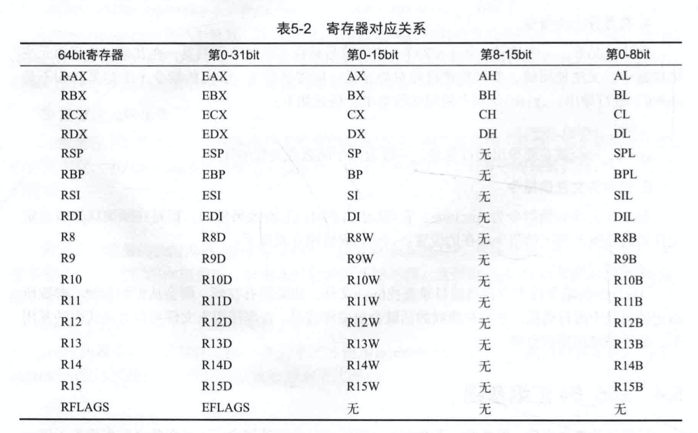
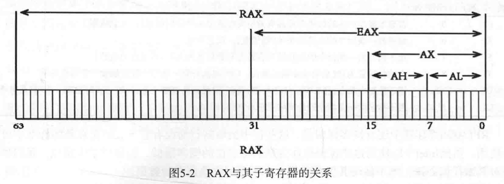
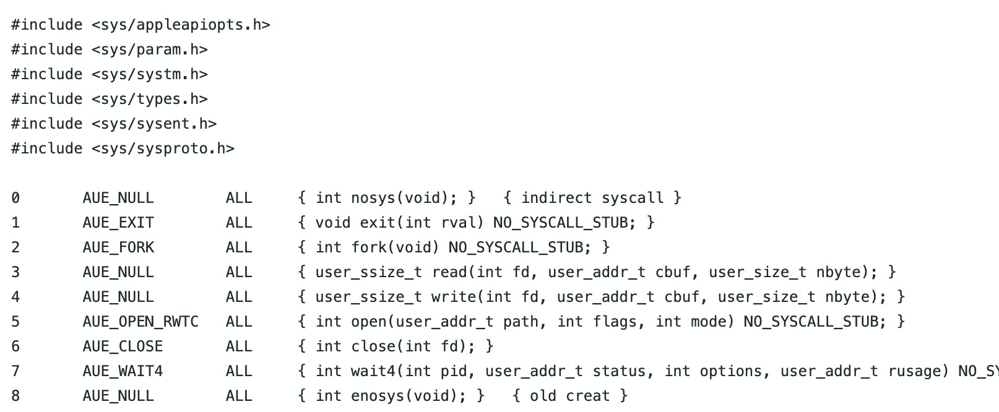

# 汇编基础

作者在maxOS平台下搭建汇编语言的开发环境

## 搭建汇编语言开发环境

作者最终选择了Xcode和Xcode工具链中的as汇编器作为主要的开发工具. 因为它由苹果官方提供, 稳定性好, 更方便与Xcode,Clang等工具配合, 并且该汇编器同时支持Intel语法和AT&T语法. Xcode则可以挺过一键编译, 调试和语法高亮等功能.
`Hello.c`
```c
#include <stdio.h>
int main()
{
  puts("Hello World!");
  return 0;
}
```
使用Clang将其编译成汇编代码. 让Clang编译器编译Hello.c,但是并不生成可执行程序或者机器码, 而是生成汇编代码

```sh
$ clang -O2 -S -masm=intel -fno-asynchronous-unwind-tables Hello.c
```
- `-masm=intel`: 语法格式为Intel语法
- `-O2`: 启动优化, 如果不启动优化, 生成的汇编代码中会有一些无用的指令
- `-fno-asynchronous-unwind-tables`: 阻止编译器生成`.cfi`系列的伪指令, 主要是用于记录栈帧信息, 平时编写汇编时基本上不会用到

执行完成后生成`Hello.s`

```s
	.section	__TEXT,__text,regular,pure_instructions 
	.build_version macos, 10, 15	sdk_version 10, 15
	.intel_syntax noprefix
	.globl	_main                   ## -- Begin function main
	.p2align	4, 0x90
_main:                                  ## @main
## %bb.0:
	push	rbp
	mov	rbp, rsp
	lea	rdi, [rip + L_.str]
	call	_puts
	xor	eax, eax
	pop	rbp
	ret
                                        ## -- End function
	.section	__TEXT,__cstring,cstring_literals
L_.str:                                 ## @.str
	.asciz	"Hello World!"


.subsections_via_symbols
```
将一个汇编源文件编译成可执行文件一般需要两个步骤:

1. 首先使用as汇编器将源代码编译成`.o`文件
```sh
as Hello.s -o Hello.o
```

2. 使用ld命令进行链接得到可执行文件
```sh
ld Hello.o -e _main -lsystem -arch x86_64 -macos_version_min 10.12.0 -o Hello
```
- `-e(entry)`: 制定了程序的入口点为`_main`, 如果不指定默认为`_start`
- `-lsystem`: 源代码中调用了系统的函数`puts()`, 所以`-lsystem`参数链接系统的库
- `-arch`: 表示链接为64位的应用程序
- `-macosx_version_min`: 制定了运行需要的最低系统版本

以上过程是在命令行进行编译和链接. 在Xcode中的操作流程如下.

1. 新建工程
    - Xcode新建工程. 
    - 项目类型选择macOS下`Command Line Tool`, 
    - 工程名为`asm_hello`
    - 语言选择为C语言
2. 添加文件
    - 删除Xcode自动生成的`main.c`源文件
    - 新建一个`Assembly File`文件(`Hello.s`), 其内容是上文中`Hello.c`对应的汇编文件内容复
    
    - `CMD + R`可以直接运行, 可以对`Hello.s`添加断点

## Hello World代码预览
组成:
1. 伪指令(pseudo instruction), 也被称为汇编器命令(assembler directive)
    - 不是指令集中的正真指令, 一般不会生成机器码
    - 在hello world的源代码中意`(.)`开头的都是伪指令
2. 机器指令
    - 源代码中的如`push,mov,call,lea`等都是x86_64指令集中的机器指令
    - 经过汇编器操作生成对应的机器码, 并可以在程序加载后执行

代码解释:
```s
  #`.section` 指示了接下来的代码所位于的段和节区
  # `__TEXT`说明是位于程序的代码段, 
  # `__text`则是主程序代码节区, 后面的参数标识这个节区的属性
	.section __TEXT,__text,regular,pure_instructions 

  # 表示运行程序所需要的macOS最低版本是10.15
	.build_version macos, 10, 15	sdk_version 10, 15

  # 表示汇编代码使用intel语法
	.intel_syntax noprefix

  # 表示_main符号可以被链接器ld使用, 因为_main是程序的入口函数,所以它必须被链接器使用, 并将入口地址写入可执行文件的LC_MAIN加载命令
	.globl	_main                   ## -- Begin function main

  # .align只是了接下来的代码对齐方式, 这里是2^4=16字节对齐, 指令空隙部分使用0x90(nop)进行填充
	.p2align	4, 0x90

  # 以下时真正的汇编指令, 它使用"hello world!\n"字符串作为参数调用了C的puts()函数, 然后返回0结束了main函数
_main:                                  ## @main
## %bb.0:
	push	rbp
	mov	rbp, rsp
	lea	rdi, [rip + L_.str]
	call	_puts
	xor	eax, eax
	pop	rbp
	ret
                                        ## -- End function

  # 在代码段的字符串节区中定义了一个以0结尾的字符串, 在汇编代码中可以通过L_.str来引用该字符串
	.section	__TEXT,__cstring,cstring_literals
L_.str:                                 ## @.str
	.asciz	"Hello World!"

# .subsections_via_symbols伪指令表示当前的节区可以被内联到其他代码中, 并且如果没有被其他代码使用就可以被剔除掉
.subsections_via_symbols
```
## 伪指令
1. 定义节区伪指令

程序的数据和指令都是存放于不同段的节区中, 在编写汇编的时候需要指定指令和数据存放的节区.

`.section`伪指令: 指示了接下来的代码所位于的段和节区, 并指定了节区的属性

格式: `.section segname, sectname[[[, type], attribute], sizeof_stub]`
- `segname`和`sectname`分别指定段和节区的名字, 之后的3个参数为可选项
- `type`指定节的类型
- `attribute`指定该节区的属性, 该参数可以省略, 表示该节区没有特殊属性. 如`pure_instructions`表示该节区中只包含指令代码, 一般用于`__TEXT`段, `__text`节区
- `sizeof_stub`参数只在type为`symbol_stubs`时需要, 用于指定`symbol stubs`的大小

| type可选值 | 说明 |
| ---- | ---- |
| regular | regular类型的节区可以包含任意的代码或数据, 并且链接器不会对它们做任何特殊处理 |
| cstring_literals | cstring_literals类型的节区一般用于存储C类型的字符串字面量,也就是以空字符`\0`结尾的字符串. 链接器会将该节区中的相同的字符串进行合并, 只保留一份备份, 并对引用字符串的地址进行重定位.</br> 由于字面量属于常量, 所以不应该对其进行修改, 链接器会将代码中引用的相同的字符串只保留一份实例, 然后将所有引用该字符串的代码所使用的地址重定位到该实例上 |
| 4byte_literals, 8byte_literals, 16byte_literals | 用于存放4字节, 8字节, 16字节的字面量, 与cstring_literals类似, 链接器也会对该节区中的常量进行合并, 并对引用的地址进行重定位 |
| symbol_stubs | symbol_stubs节区一般是由编译器生成的, 用于保存未定义的函数的桩代码, 一般为动态库中的函数, 方便程序在加载时动态填充函数的地址, 一般对应Mach-O文件格式中的__stub节区.该节区中所有符号的大小相同, 由`.section`伪指令中的`sizeof_stub`参数指定 |

用于`.section`伪指令参数较多, 为了方便使用, as汇编器提供了一些伪指令方便节区的定义. 对应关系如图:


按照表中的对应关系, 上述代码可以简化为:
```s
.text 
	.build_version macos, 10, 15	sdk_version 10, 15
	.intel_syntax noprefix
	.globl	_main                   ## -- Begin function main
	.p2align	4, 0x90
_main:                                  ## @main
## %bb.0:
	push	rbp
	mov	rbp, rsp
	lea	rdi, [rip + L_.str]
	call	_puts
	xor	eax, eax
	pop	rbp
	ret
                                        ## -- End function
	.cstring
L_.str:                                 ## @.str
	.asciz	"Hello World!"

```

2. 对齐伪指令

在x86_64架构的CPU上, 以4字节或8字节对齐的数据存取速度最快. 伪指令`.align`用于指示汇编器之后的数据和指令的对齐方式, 其格式如下:

`.align align_expression [, 1byte_fill_expression [,max_bytes_to_fill]]`
- align_expression 为一个整数, 以它作为2的指数运算后得到的值就是要对齐的字节数.
- 可选参数`1byte_fill_expression`和`max_bytes_to_fill`分别表示对齐时空隙中要填充的数据和最多填充多少字节

3. 数据定义伪指令
汇编语言应该算作是无类型的低级语言, 因为数据的"类型"完全取决于你如何使用它. 不过`as`汇编器还是提供了伪指令, 用于定义类似于C语言中的数据类型, 以方便我们使用.

- 整型

定义整型数据的伪指令有`.byte, .short, .long 和 .quad`这4种, 长度分别为1,2,4,8字节.它们的作用相同, 只是定义的数据长度不同.

以byte为例:
`.byte [expression] [, expression] ...`
`.byte`伪指令在当前节区开辟一块内存, 并使用`expression`提供的值对其进行初始化, 每个`expression`表达式的值占一个字节.
```s
.data
foo: .byte 1,2,3,4 #可以理解为在.data节区定义了一个byte数组, 其中有4个元素, 值分别是1到4. 可以通过foo标号引用这个数组
```

- 浮点型

浮点型数据有4字节的单精度浮点型数据和8字节的双精度浮点型数据两种. 分别使用`.single`和`.double`进行定义, 定义浮点型数据的伪指令使用方式与定义整型数据的伪指令使用方式一样. as汇编支持用`+Infinity, -Infinity, NaN`来表示正无穷, 负无穷以及无效的数字.

- 字符串
as汇编器通过了两种定义字符串的伪指令. 

一种是`.asciz`用于定义类似于c语言字符串字面量的字符串. 格式: `.asciz ["string"] [, "string"] ...`, 这个伪指令用于在当前节区定义一个字符串, 字符串以0结尾.

另一种是`.ascii`与`.asciz`的差别是它并不会自动在字符串末尾加0. 以下3种写法效果是一样的:

```s
.asciz "hello"
.ascii "hello\0"
.byte 'h','e','l','l',0x6f,0 # 0x6f是字母o的ASCII码值
```
4. 符号导出伪指令
默认情况下, 一个编译单元(.s文件)中的符号只在本编译单元可见, 在其他的编译单元或者链接器中是无法使用的, 如果要使符号对外可见, 则需要使用`.globl`伪指令(注意是`globl`不是`global`)进行导出. 格式: `.globl symbol_name`. symbol_name就是要导出的符号名, 一般为某个函数或者变量的标号.


5. 包含头文件伪指令
包含文件头的伪指令为`.include`, 它与C语言的`#include`效果相同, 都是在预编译期将指定文件的内容插入到该伪指令所在的位置. 使用方式:
```s
.include "foo.h"
```
`.include`伪指令首先会在当前目录查找`foo.h`文件, 如果没有找到, 则会从汇编器的`-I`参数所指定的目录中进行查找, 都没有找到的话就会报编译错误.


## x86_64汇编基础
汇编指令很少会直接使用除了CPU中的寄存器和内存以外的硬件资源, 而是通过系统提供的各种编程接口来访问各种外部设备

### 寄存器
寄存器(Register)是CPU中一种用于临时存储数据的高速存储单元, 它的存取速度是所有存储介质中最快的, 不过其容量非常小.

在x86_64架构中根据功能的不同分为通用寄存器, 段寄存器, 控制寄存器, 浮点寄存器, 标志寄存器, 调试寄存器等.在较新的支持MMX, SSE和AVX指令集的CPU中, 还有这些指令集专用的MMX寄存器, SSE寄存器和AVX寄存器

1. 通用寄存器
x86_64架构中共有16个通用寄存器(General Purpose Registers, GPRs), 大小都是64bit. 这些寄存器也可以进行拆分为32bit, 16bit或8bit的寄存器.




在x86_64汇编中, 操作32位的寄存器会对整个64位寄存器造成影响, 比如将EAX寄存器赋值为1, 则整个REX寄存器也会被赋值为1, 而不是只有第32位被赋值为1, 操作16位或8位的寄存器则不会有此影响.

大多数寄存器在特定的时候都会专门的作用, 如

- `RCX`: 称为计数器(Counter),在使用重复前缀(REP)指令和LOOP指令时用于计数.
- `RDX`: 在进行除法运算时用作存放余数.
- `RSP`: 栈指针寄存器, 用于存放当前任务的栈顶指针.
- `RBP`: 基址指针寄存器, 一般被用存放作高级语言函数调用中栈帧的基地址.


3. 指令指针寄存器
- `RIP`用于存放CPU将要执行的下一条指令的地址, 该寄存器是无法再汇编代码中直接修改, 是由控制转移指令和CPU按照规则自动管理.

当CPU执行完一条指令之后, RIP会执行该指令的下一条指令, 如果执行的是跳转指令或者函数调用指令等控制转移指令, 则会将RIP设置为控制转移指令的目标地址

RIP寄存器对应32位汇编中的EIP寄存器, 该寄存器在32位汇编代码中是无法使用的, 但是在64位汇编中却可以使用, 不过此时RIP寄存器的作用并不是指令指针寄存器, 而是保存这数据段基地址. 由于IA-32指令体系的限制, 指令中的立即数长度是无法超过4字节的, 因此在内存寻址中要访问完整的8字节的地址需要使用RIP寄存器作为基地址.

4. 标志寄存器
标志寄存器(RFLAGS)中存储着一组影响CPU行为的标志, 或用于指示上一条指令的执行状态, 其中常用的标志位及其作用如下:

| 名称 | bit位 | 作用 | 
| ---- | ---- | ---- |
| CF | 0 | 若算术操作产生的结果在最高有效位发生进位或借位则被置1, 反之清零 |
| ZF | 6 | 如果前一条指令的运算结果为0则被置1, 反之清零 |
| SF | 7 | 用于指示前一条指令的执行结果在最高有效位是否为1(即是否为负数) |
| TF | 8 | 当该位被置为1时启动单步调试模式, CPU每执行完一条指令就会触发一个单步异常 |
| DF | 10 | 用于控制串指令(MOVS,LODS等)执行时地址为递增还是递减, 为1时递减, 为0则是递增 |
| OF | 11 | 用于指示前一条指令的计算结果是否有溢出 |

RFLAGS寄存器还有许多保留位, 我们尽量不对其做任何处理, 既不使用其保存数据, 也不适用这些位中的数据.

5. 其他寄存器
x86_64架构中除了通用寄存器之外, 还有许多其他寄存器, 但是其涉及的功能比较复杂. 这些寄存器主要包括以下7种
- 浮点寄存器: 用于处理浮点数的一组寄存器. 由于早期浮点数处理是有一个单独的协处理器x87进行处理的, 所以浮点指令所使用的寄存器与普通指令并不相同, 而是使用单独的浮点寄存器.
- 段寄存器: 用于存放段基地址的寄存器. 本章中的代码都处于平坦模式下, 所有的段都使用相同的基地址, 在x86_64汇编中一般不需要用到段地址.
- MMX寄存器: MMX指令集可以使用的一组寄存器
- SSE寄存器: SSE指令集可以使用的一组寄存器
- AVX寄存器: AVX指令集可以使用的一组寄存器
- 控制寄存器: 与标志寄存器类似的一组寄存器, 用于控制CPU运行行为
- 调试寄存器: 用于软件调试的一组寄存器

### 汇编语法

一个汇编源程序主要由伪指令和其他的汇编指令组成.x86_64汇编中主流的语法有2种, 一种是Intel官方使用的Intel语法, 在Windows系统中使用也十分广泛.另一种常用的语法是AT&T语法, 这种语法是由贝尔实验室设计的, AT&T语法在UNIX环境中使用广泛, 因为最初的UNIX系统也是贝尔实验室开发的.

Intel语法:

汇编指令格式: `label: prefix mnemonic operand #comment`
- `label`: 对应本条指令的地址
- `prefix`: 指令前缀, Intel把所有的前缀分为4组, 一条指令可以有0-4个前缀
- `mnemonic`: 助记符用来表示具体是哪一条指令
- `operand`: 操作数时这条汇编指令要操作的数据, 可以是内存, 寄存器或立即数. 操作数可以有0-3个(逗号隔开). 一般在有2个操作数的情况下, 第一个操作数称为目标操作数, 第二个操作数称为源操作数. x86_64汇编不支持2个操作数都是内存操作数, 目标操作数也不可以是立即数.

- `#comment`: 以`#`开头的部分是注释

一条有效的汇编语句必须要有助记符(其余部分都可能没有):
```s
lab1: mov rax, 123 #将123送入rax寄存器
```

内存寻址: x86_64是复杂指令集, 内存寻址方式很多(6种, 忽略了段寄存器).内存寻址通俗来讲就是如何让指令知道要操作的内存的地址及大小. 不同寻址方式的本质上的差异是如何计算这个内存地址.

内存操作数格式: `size ptr [address]`
- size: 表示该操作数的大小, 可以是`byte(1),word(2),dword(4),qword(8)`
- address: 有6种表示方式
1. 立即寻址: address部分就是一个内存地址, 如`byte ptr [0x123456]`操作数表示内存地址`0x123456`位置一字节大小的内存
2. 寄存器间接寻址: address部分为一个寄存器, 寄存器中保存着操作数的内存地址.如: `byte ptr [rax]`
3. 寄存器相对寻址: 在寄存器间接寻址的基础上加上一个立即数. 如: `byte ptr [rax + 0x100]`
4. 基址加变址寻址: 与寄存器相对寻址类似, 但是并不是加上一个立即数, 而是加上另一个寄存器. 如: `byte ptr [rax + rbx]`, 此外, 变址部分keys寄存器与`2,4或8`的乘积. 如: `byte ptr [rax + rbx*8]`
5. 相对基址加变址寻址: 在基址加变址的基础上增加或减去一个偏移量. 如: `byte ptr [rax + rbx*8 - 0x1234]`
6. 在x86_64中新增了一种基于RIP寄存器的RIP相对寻址, 就是addresss部分为RIP加上以偏移量. 如: `byte ptr [rip + 0x1234]`

大部分汇编器对于内存操作数还支持一些比较灵活的格式, 如果内存操作数的大小可以确定, 则可以不用写`size ptr`. 如`mov rax, qword ptr [rbx]`就可以简写成`mov rax, [rbx]`. 在无法确定操作数大小的时候不可省略, `mov [rbx], 1`是错误写法, 汇编器无法确定目标操作数的大小.

address部分如果有偏移量, 可以将偏移量写在方括号外. 如`mov rax, qword ptr [rax + rbx*8 + 0x1234]`可以写成`mov rax, qword ptr 0x1234[rax + rbx*8]`.

操作数寻址比较强大, 甚至有时可以用于整数运算, 这就需要用到`lea`指令. lea指令用于计算第二个操作数的有效地址, 并将它存到第一个操作数中.可以利用这个特性将要计算的数据当做地址进行计算, 然后由`lea`指令将其存储到第一个操作数中.

```s
lea rax, qword ptr [rax + rbx*8 + 0x1234] #本指令会将rax+rbx*8+0x1234的结果存储到RAX寄存器中.
```

AT&T语法:

在as汇编器中默认的汇编语法就是AT&T语法, as汇编器对Intel语法支持并不是特别完整, 比如在Intel语法中单行注释应该是以`;`开始(而不是`#`), 立即数中16进制格式是以`h`结尾(而不是c格式的`0x`开头).

AT&T格式的汇编与Intel汇编的差异:
| 项目 | AT&T差异 | AT&T示例 | Intel示例 |
| ---- | ---- | ---- | ---- |
| 立即数 | 需要在立即数前加`$`符号 | $123 | 123 |
| 寄存器 | 需要在寄存器前加`%`符号 | %rax | rax |
| 助记符 | 助记符之后需要增加一个单独的字符来表示操作数的大小 | `mov`对应`1,2,4,8`字节的操作数时 <br/> 需要写成`movb,movw,movl,movq`| mov |
| 操作数位置 | 源操作数和目标操作数与Intel语法位置相反 | 将123送入到rax<br/> `movq $123, %rax`| mov rax, 123|
| 内存操作数 | 内存操作数的格式不同 | `movb 0x1234(%rax, %rbx, 4), %rax` <br/> `movb $0x12,(%rax,%rbx)`| `mov byte ptr[rax + rbx *4 + 0x1234]`<br/>`mov byte ptr [rax + rbx], 0x12`|

### 数据传送指令

数据传输指令用于将数据从一个操作数负责到另一个操作数, 或将两个操作数中的数据进行交换. 最常用的数据指令`mov`用于将源操作数复制到目标操作数中,虽然该指令名为移动(move),但实际上并不会清空源操作数, 应该称之为复制指令.

1. 源操作数: 可以是立即数,通用寄存器, 段寄存器, 内存位置
2. 目标操作数: 可以是通用寄存器,段寄存器, 内存位置

注意: x86_64指令编码的限制, 源操作数和目标操作数不能同时是内存位置 

如果需要交换两个操作数中的内容, 则可以使用`xchg`指令. `xchg`指令也不支持2个操作数都是内存位置,不过如果某个操作数是内存位置, 则`xchg`指令会对总线进行加锁操作, `xchg`指令总能`原子`地交换两个操作数.

### 控制转移指令
控制转移指令一般分为2种:

1. `函数调用和返回`指令
2. 跳转指令
   -  将`RIP`设置为操作数所指定的地址, 即CPU会从操作数指定的地址处继续执行
   -  `无条件跳转`: jmp指令不执行任何判断, 直接将`RIP`设置为操作数指定的地址
   -  `有条件跳转`: 根据条件进行判断, 符合条件的情况下才会设置`RIP`
指令与跳转条件的对应:

| 指令 | 跳转条件 |
| ---- | ---- |
| ja,jg,jnbe | 高于(CF=0且ZF=0)时跳转 |
| jae,jge,jnbn,jnc | 高于或等于(CF=0)时跳转 |
| jb,jc,jnae | 低于(CF=1)时跳转 |
| jbe,jna | 低于或等于(CF=1或ZF=1)时跳转 |
| je,jz | 等于(ZF=1)时跳转 |
| jl,jnge | 小于(SF<>OF)时跳转 |
| jle,jng | 小于或等于(ZF=1或SF<>OF)时跳转 |
| jne,jnz | 不相等(ZF=0)时跳转 |
| jno | 无溢出(OF=0)时跳转 |
| jo | 溢出(OF=1)时跳转 |
| jnp, jpo | 奇校验(PF=0)时跳转 |
| jp | 偶校验(PF=1)时跳转 |
| jns | 正数(SF=0)时跳转 |
| loop | 将RCX寄存器减1, 如果RCX为0则跳转 |
| loope, loopz | 将RCX寄存器减1, 如果RCX为0且ZF=1则跳转 |
| loopne, loopnz | 将RCX寄存器减1, 如果RCX为0且ZF=0则跳转 |

跳转指令中有许多指令相同但是助记符不同的情况, 如`ja,jg,jnbe`这3个助记符的机器码完全相同, 只是为了方便使用, 所以有多个助记符.

函数调用指令`call`和返回指令`ret`可以看成是变种的无条件转移指令.
- call: 在效果上等于将RIP寄存器压入堆栈, 然后跳转到操作数指定的位置
- ret: 从栈中弹出一个值, 并将这个值作为地址跳转过去

### 栈操作指令
一个程序运行时的内存一般可以简单地划分3个区:

1. 代码区: 用于存放程序的代码
2. 静态数据区: 用于存放全局变量和静态变量
3. 动态数据区: 用于存放程序运行时动态申请的内存
    - 堆: C语言中, 使用`malloc`函数申请的内存都位于堆区.(这里的堆与数据结构中的堆不同)
    - 栈: 局部变量和函数的参数位于栈.

在堆申请的内存, 一般需要程序员手动释放, 但是有的高级语言具有垃圾回收机制或引用计数, 可以帮助程序员进行回收.

在高级语言中, 栈一般是由编译器进行管理的. 不过在汇编预言者, 需要手工使用汇编指令操作栈, 在调用函数时还需要遵守调用约定保持栈的平衡.

操作栈常用指令:

| 指令 | 描述 |
| --- | --- |
| push | 递减堆栈指针(RSP), 然后将源操作数存储到栈顶 |
| pop | 将栈顶的值加载到目标操作数指定的位置, 然后递增堆栈指针(RSP) |
| pushfq | 将堆栈指针递减8, 并将RFLAGS寄存器的全部内容压入堆栈 |
| popfq | 将栈顶的四字(8位)弹出, 并将它的值存储到RFLAGS寄存器 |

在32位的x86汇编中还有`pushad,popad`指令用于一次性将所有通用寄存器压入, 弹出栈. 但是在64位汇编中不支持这2个指令

### 运算指令
x86_64汇编直接支持不超过64位的整数的加减乘除运算, 不过对于更大的数的运算, 就需要自己实现或使用第三方库. 除了普通的四则运算, 还支持逻辑与,或,非等指令.


| 运算指令 | 描述 |
| ---- | ---- |
| add | 加法指令, 将第一个操作数和第二个操作数相加, 并将结果存储到第一个操作数中. 根据补码的特性, add 指令不需要区分有符号或无符号操作数, 但是会根据两种数据类型的计算结果设置OF与CF标志为1, 以表示有符号或无符号结果的进位. SF标志表示有符号结果的符号 |
| adc | 带进位加法, 与add指令不同之处在于该指令会将CF标志位一并加上 |
| sub | 减法指令, 使用第一个操作数减去第二个操作数, 并将结果存储到目标操作数中. 同样不区分操作数是否有符号, 但是会根据两种数据类型的计算结果设置OF与CF标志位1, 以表示有符号或无符号结果的借位. SF标志表示符号结果的符号 |
| sbb | 带借位减法, 与sub指令不同之处在于该指令会将CF标志位一并减去 |
| mul | 无符号乘法指令, 将操作数与隐含操作数进行无符号乘法操作, 计算结果则分成两部分存在于两个寄存器中. 当操作数大小为8/16/32/64位时, 另一个乘数分别对应为AL/AX/EAX/RAX, 结果存储在AX/DX:AX/EDX:EAX/RDX:RAX中 |
| imul | 有符号乘法指令, 该指令可以有一个, 两个或三个操作数.<br/> 当有一个操作数时, 操作数规则与mul相同;<br/>当有2个操作数时, 则将第一个操作数与第二个操作数相乘, 并将结果存储到第一个操作数中; <br/>有3个操作数时, 将第二个操作数与第三个操作数相乘, 并将结果存储到第一个操作数中 |
| div | 无符号触发指令, 操作数为除数, 当操作数大小为8/16/32/64位时, 被除数对应为AX/DX:AX/EDX:EAX/RDX:RAX, 商保存在AL/AX/EAX/RAX中, 余数保存在AH/DX/EDX/RDX中|
| idiv | 有符号除法指令, 操作数规则与div相同 |
| xor | 逻辑异或指令, 第一个操作数与第二个操作数执行逐位异或运算, 将结果存储到第一个操作数中 |
| or | 逻辑或指令, 第一个操作数与第二个操作数执行逐位或运算, 将结果存储到第一个操作数中 |
| and | 逻辑与指令, 第一个操作数与第二个操作数执行逐位与运算, 将结果存储到第一个操作数中 |
| not | 逻辑非指令, 对目标操作数执行逐位"非"操作, 将结果存储到目标操作数位置 |

## 与其他模块的交互

### 与C语互相调用
相互调用分为2个方面:
1. 从汇编中调用C语言的函数
2. C语言调用汇编语言的函数
调用约定: 进行函数调用则需要调用者和被调用者直接有一个统一的约定来传递参数和清理栈

在32位环境中, 调用约定比较多, 有`cdecl, stdcall, fastcall`等. 在64位环境中调用约定比较统一(在不同的操作系统有一些差异, 本文只关心macOS系统).

在64位的类UNIX系统中, 调用约定都遵守`System V AMD64 ABI reference`文档中所描述的调用约定, 函数的前6个整型参数保存在`RDI,RSI,RDX,RCX,R8,R9`寄存器中.如果是浮点参数, 则保存在XMM0到XMM7寄存器中. 剩下的参数则压入栈中, 函数需要通过栈指针获取这些参数. 整型返回值保存在RAX寄存器中, 浮点型返回值保存在XMM0中.

示例1: 从汇编中调用C语言
用xcode新建一个macOS CommandLine tools
`print.c`
```c
#include <stdio.h>
#include <stdint.h>
uint64_t foo(uint64_t a1, uint64_t a2,uint64_t a3,uint64_t a4,uint64_t a5,uint64_t a6,uint64_t a7,uint64_t a8,uint64_t a9,uint64_t a10){
    printf("a1=%lld, a2=%lld, a3=%lld, a4=%lld, a5=%lld, a6=%lld, a7=%lld, a8=%lld, a9=%lld, a10=%lld", a1,a2,a3,a4,a5,a6,a7,a8,a9,a10);
    return a1+a2+a3+a4+a5+a6+a7+a8+a9+a10;
}

```
`main.s`
```s
.text
.intel_syntax noprefix
.globl       _main
.align      4, 0x90
_main:
    push rbp
    mov rbp,rsp
    push 10
    push 9
    push 8
    push 7
    mov r9d, 6
    mov r8d, 5
    mov ecx, 4
    mov edx, 3
    mov esi, 2
    mov edi, 1
    call _foo			# 调用c函数, c函数foo会被命名为_foo
    add rsp, 32		# 恢复栈指针, 由于函数开始时连续执行了4次push
    pop rbp
    ret
```
运行结果:
```
a1=1, a2=2, a3=3, a4=4, a5=5, a6=6, a7=7, a8=8, a9=9, a10=10Program ended with exit code: 55
```

代码解释:
1. 前6个参数使用寄存器传递, 此处只用32位寄存器是因为x86_64的机制. 如将1送入edi, 实际上rdi的值也为1. 但是如果使用`mov rdi, 1`, 由于需要`rex prefix`将会导致生成的机器码边长. 生效的a7-a10参数是放到堆栈上进行传递的.
2. 根据C函数命名的规定, 在C代码中定义的函数在汇编中使用时需要在函数名前加一个下划线, 这里调用的是`_foo`. 调用完毕后由调用者负责将栈恢复平衡, 在调用函数时向栈上压入4个8字节的参数, 所以这里使用`add rsp, 32`来修改栈指针.
3. 返回值保存在rax寄存器中, 然后rax寄存器又被当做main函数的返回值返回给了额操作系统, 所以输出`Program ended with exit code: 55`


示例2: 从C语言中调用汇编

`main.c`
```c
#include <stdio.h>

uint64_t foo(uint64_t a1, uint64_t a2,uint64_t a3,uint64_t a4,uint64_t a5,uint64_t a6,uint64_t a7,uint64_t a8,uint64_t a9,uint64_t a10);

int main(int argc, const char * argv[]) {
    // insert code here...
    printf("Result is %lld", foo(1,2,3,4,5,6,7,8,9,10));
    return 0;
}

```
`foo.s`
```s
.section  __TEXT,__text,regular,pure_instructions
.macosx_version_min 10,15
.intel_syntax noprefix
.globl       _foo
.align      4, 0x90
_foo:
    push rbp
    mov rbp,rsp
    lea rax,[rdi+rsi]
    #mov rax,rdi
    #add rax,rsi
    add rax,rdx
    add rax,rcx
    add rax,r8
    add rax,r9
    add rax, qword ptr [rbp + 16]
    add rax, qword ptr [rbp + 24]
    add rax, qword ptr [rbp + 32]
    add rax, qword ptr [rbp + 40]

    pop rbp
    ret

```
注意: 如果参数或者返回值的宽度不是64位的, 在使用的时候需要使用相应宽度的寄存器. 不过放到栈上的参数任然是64位的, 在使用的时候需要自己取出对应宽度的值.

### 使用系统调用

为了保护系统内核不会轻易地被其他代码所破坏, 处理器需要对代码进行权限分级. 低权限的代码将不能执行某些特权指令, 不能访问高权限代码的地址空间.

- 内核模式: 系统内核一般都运行在高权限模式
- 用户模式: 普通应用程序的代码运行在低权限下

当普通权限的代码需要使用内核提供的功能时, 需要通过上下文切换方式切换到内核模式中.在`x86_64`处理器中提供了`Ring0-Ring3`这4个权限级别, 而`macOS`系统只使用了其中2个权限级别, 系统内核运行在Ring0级别, 用户态代码则运行在Ring3, 从用户态切换到内核态需要使用syscall指令(在32位系统上使用的是sysenter指令), 从内核态返回到用户态则需要使用sysexit指令.

macOS系统调用的约定也遵循`System V AMD64 ABI reference`文档中所描述的系统调用约定, 与普通函数的调用约定十分相似, 系统调用的前6个参数存放在`RDI,RSI,RDX,RCX,R8,R9`寄存器中, 超过6个的部分放到栈中, 返回值存放于RAX寄存器

系统调用都需要一个调用号, 系统调用号与系统调用之间的对应关系可以参考[XNU源码中`bsd/kern/syscalls.master`](https://github.com/apple/darwin-xnu/blob/master/bsd/kern/syscalls.master)文件



这个文件会被脚本编译成C语言代码, 其中第一列就是系统调用号(要加上`0x2000000`才是真正的系统调用号), 后面则是这个系统调用的C语言的函数声明.

示例: 在控制台中输出`Hello world`

`hello_syscall.s`
```s
.text
.intel_syntax noprefix
.globl  _main
_main:
    mov edi, 1
    lea rsi, [rip + str]
    mov rdx, 12
    mov rax, 0x2000004
    syscall

    xor eax,eax
    ret
.cstring
str:
    .ascii "Hello World\n"

```
此处的系统调用号是4, 根据`syscalls.master`可以找到对应的是write系统调用:
```c
user_ssize_t write(int fd, user_addr_t cbuf, user_size_t nbyte);
```
该调用用于向一个文件描述符中写入内容, 第一个参数是文件描述符, 当该参数为1时表示写到控制台上进行显示, 后两个参数分别是要写入的内容和长度