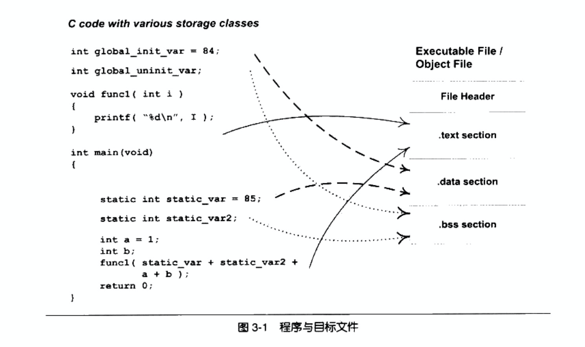
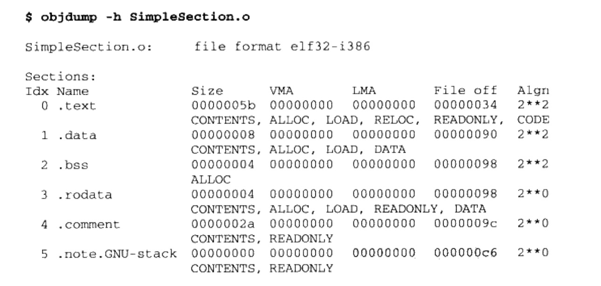
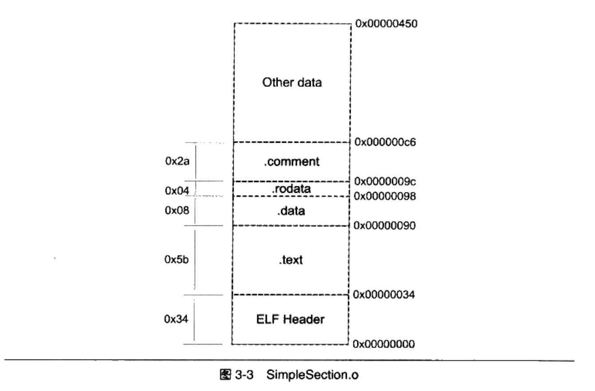
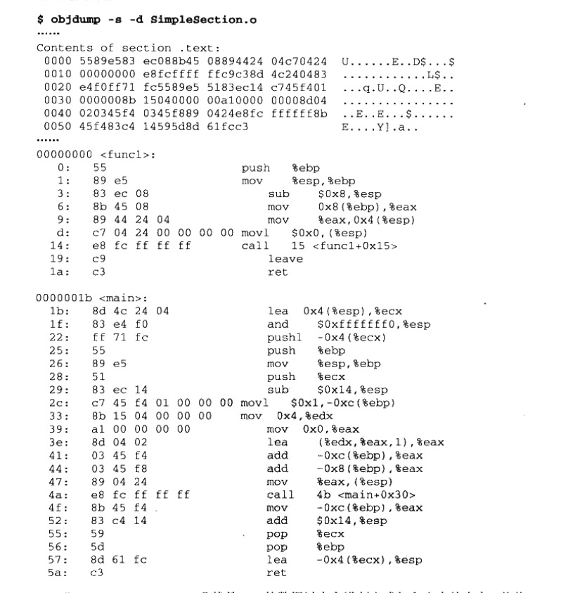
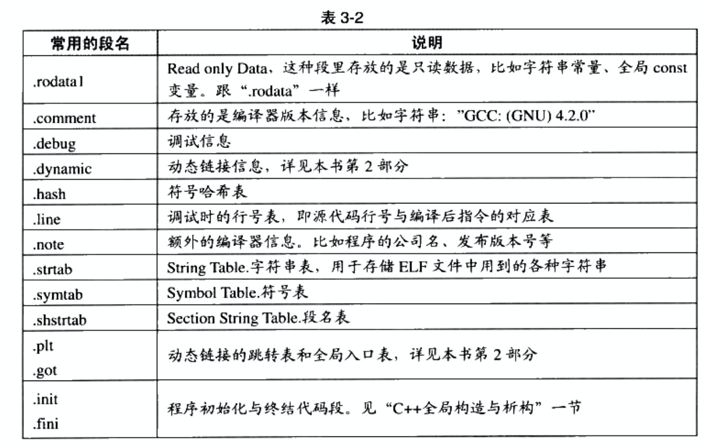
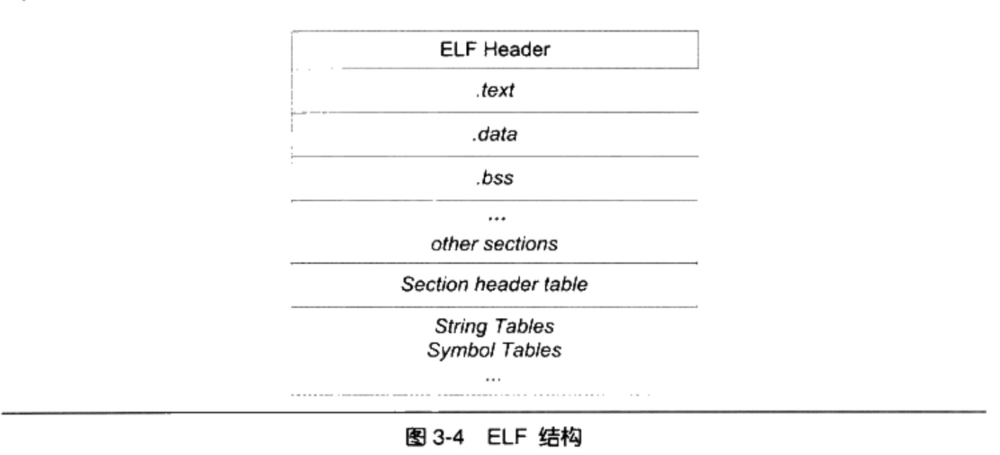
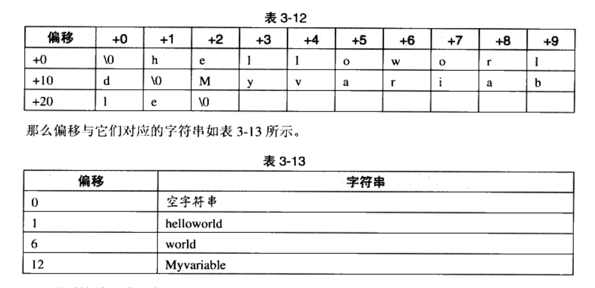

# 目标代码里有什么
目标文件从结构上讲,是已经编译后的可执行文件格式, 只是还没有经过链接过程. 其中可能有些符号或有些地址还没有被调整. 但其本身就是按照可执行文件格式存储的, 只是跟真正的可执行文件在结构上稍有不同.


## 目标文件的格式
现在PC平台流行的可执行文件格式(Executable)主要有:
- Windows下PE(Portable Executable), 称为PE-COFF文件格式
- Linux下ELF(Executable Linkable Format), 称为ELF文件
它们都是COFF(Common file format)格式的变种.
目标文件就是源代码编译后但未进行链接的中间文件(windows下的.obj和linux下的.o), 它跟可执行文件的内容与结构很相似, 一般跟可执行文件格式一起采用一种格式存储.


| ELF文件类型 | 说明 | 实例 |
| --- | --- | --- |
| 可重定位文件</br>(Relocatable File)| 这类文件包含了代码和数据, 可以用来连接成可执行文件或共享目标文件, 静态链接库也可以归为这一类 | Linux的.o </br> Windows的.obj|
| 可执行文件</br>(Executable File) | 这类文件包含了可以直接执行的程序, 它的代表就是ELF可执行文件, 它们一般没有扩展名  | 如 /bin/bash文件 </br>Windows的.exe|
| 共享目标文件</br>(Shared Object File)| 这种文件包含了代码和数据, 可以在以下2种情况下使用. 一种是链接器可以使用这种文件跟其他的可重定位文件和共享目标文件链接, 产生新的目标文件. 第2种是动态链接器可以将几个这种共享目标文件与可执行文件结合, 作为进程映像的一部分来运行  | Linux的 .so 如/lib/glibc-2.5.so</br>Windows的DLL |
| 核心转储文件 </br>(Core Dump File)| 当进程意外终止时, 系统可以将该进程的地址空间的内容及时终止时的一些其他信息转储到核心转储文件| Linux下的core dump|

## 目标文件是怎么样的
目标文件中的内容有编译后的机器指令代码, 数据. 还有链接所需要的一些信息, 比如符号表, 调试信息, 字符串等.

目标文件将这些信息按不同的属性, 以节(`Section`)的形式存储(也叫段`Segment`), 表示一个一定长度的区域.

- 程序源代码编译后的机器指令经常被放在代码段(`Code Section`)里, 代码段常见的名字有`.code, .text`
- 全局变量和局部静态变量数据经常放在数据段(`Data Section`), 数据段的一般名字叫`.data`

一个简单的程序被编译成目标文件后的结构:


1. 文件头
  - 描述了整个文件的文件属性, 包括文件是否可执行, 是静态链接还是动态链接及入口地址(如果是可执行文件), 目标硬件, 目标操作系统等
  - 包括一个段表(Section Table), 一个描述文件中各个段的数组, 描述了文件中各个段在文件中的的偏移位置及段的属性等
  - 文件头后面就是各个段的内容

2. `.text`段
    - c语言的编译后执行预计都编译成机器代码, 保存在`.text`段
3. `.data`段
    - 已经初始化的全局变量和局部静态变量都保存在`.data`段
4. `.bss`段
    - 未初始化的全局变量和局部静态变量一般放在`.bss`段
    - `.bss`段只是为未初始化的全局变量和局部静态变量预留位置而已, 它并没有类容, 所以在文件中不占据空间

总体来说, 程序源代码被编译以后主要分成两种段: 程序指令和程序数据. 代码段属于程序指令, 数据段和.bss段属于程序数据


## 挖掘`SimpleSection.o`
```shell
gcc -c SimpleSection.c

objdump -h SimpleSection.o
```




### 代码段

objdump `-s`参数可以将所有段的内容以16进制打印出来. `-d`参数可以将所有包含指令的段反汇编.

```shell
objdump -s -d SimpleSection.o
```


### 数据段和只读数据段
`.data`段保存的是已经初始化了的全局静态变量和局部静态变量. SimpleSection.c代码里面一共有两个这样的变量, 分别是`global_init_varable`和`static_var`每个4字节, 共8字节

`.rodata`段存放的是只读数据, 一般是程序里面的只读变量(如const修饰的变量)和字符串常量.

### bss段
`.bss`段存放的是未初始化的全局变量和局部静态变量. 如`global_uninit_var`和`static_var2`. `.bss`段为它们预留了空间.

### 其他段
除了`.text,.data,.bss`这3个最常用的段之外, `ELF`文件也有可能包含其他的段, 用来保存于程序相关的其他信息.


这些段的名字都是由`.`作为前缀, 表示这些表的名字是系统保留的, 应用程序也可以使用一些非系统保留的名字作为段名.

自定义段: 正常情况下,GCC编译出来的目标文件中, 代码会被放到`.text`段.为了满足某些硬件的内存和I/O的地址布局, 或者像Linux操作系统内核中来完成一些诸如和用户控件复制时出现页错误异常等.GCC提供了一个扩展机制, 使得程序员可以指定变量所处的段.
```c
__attribute__((section("FOO"))) int global = 42;
__attribute__((section("FOO"))) void foo(){

}
```
在全局变量或者函数之前加上`__attribute((section("name")))`属性可以把相应的变量或函数放到以`name`作为段名的段中.

## ELF文件结构描述



ELF文件头(ELF Header): 描述整个文件的基本属性, ELF文件版本, 目标机型号, 程序入口地址
段表(Section Header Table): 描述了ELF文件包含的所有段的信息, 每个段的段名, 段的长度, 在文件中的偏移, 读写权限及段的其他属性.

### 文件头

```sh
readelf -h SimpleSection.o
```
ELF文件头结构及相关常数被定义在`/usr/include/elf.h`里, ELF文件有32位版(Elf32_Ehdr)本和64位版本(Elf64_Ehdr)

```c
/* The ELF file header.  This appears at the start of every ELF file.  */
#define EI_NIDENT (16)
typedef struct
{
  unsigned char e_ident[EI_NIDENT];     /* Magic number and other info */
  Elf32_Half    e_type;                 /* Object file type */
  Elf32_Half    e_machine;              /* Architecture */
  Elf32_Word    e_version;              /* Object file version */
  Elf32_Addr    e_entry;                /* Entry point virtual address */
  Elf32_Off     e_phoff;                /* Program header table file offset */
  Elf32_Off     e_shoff;                /* Section header table file offset */
  Elf32_Word    e_flags;                /* Processor-specific flags */
  Elf32_Half    e_ehsize;               /* ELF header size in bytes */
  Elf32_Half    e_phentsize;            /* Program header table entry size */
  Elf32_Half    e_phnum;                /* Program header table entry count */
  Elf32_Half    e_shentsize;            /* Section header table entry size */
  Elf32_Half    e_shnum;                /* Section header table entry count */
  Elf32_Half    e_shstrndx;             /* Section header string table index */
} Elf32_Ehdr;

```

ELF文件头结构和readelf输出的信息基本一一对应.不同的是`e_ident`这个成员对应了readelf输出结果中的`Class, Data, Version, OS/ABI, ABI Version`这5个参数

### 段表
段表是ELF文件中除了文件头以外最重要的结构, 描述了ELF的各个段的信息. ELF文件的段结构就是由段表决定的. 编译器, 链接器和装载器都是依靠段表来定位和访问各个段的属性.

段表在ELF文件中的位置由ELF文件头的`e_shoff`成员决定

### 重定位表
`.rel.text`段的类型(sh_type)是`SHT_REL`, 表明它是一个重定位表(Relocation Table). 它的`sh_info`表示它作用于哪个段.

链接器在处理目标文件时, 须要对目标文件中某些部位进行重定位, 即代码段和数据段中那些对绝对地址的引用的位置. 这些重定位的信息都记录在ELF文件的重定位表里面,对于每个需要重定位的代码段或数据段, 都会有一个相应的重定位表.
如: 在`SimpleSection.o`中`.rel.text`就是针对`.text`段的重定位表(`.text`段中至少有一个绝对地址的引用,对`printf`函数的调用), 而`.data`段没有绝对地址的引用, 只包含了几个常量, 所以没有针对`.data`段的重定位表`.rel.data`.

### 字符串表

ELF文件中用到了很多字符串, 如段名, 变量名等. 因为字符串的长度是不定的, 用固定的结构来表示比较困难. 一种常见的做法是把字符串集中起来存放到一个表, 然后使用字符串在表中的偏移来引用字符串.



在ELF文件中引用字符串只须给出一个数字下标即可, 不用考虑字符串长度的问题. 一般字符串表在ELF文件中也以段的形式保存, 
- 字符串表(String Table`.strtab`): 用来保存普通的字符串, 如符号的名字
- 段表字符串表(Section Header String Table`.shstrtab`): 用来保存段表中用到的字符串, 如段名(sh_name)


## 链接的接口--符号
在链接中, 目标文件之间的相互拼合实际上是目标文件之间对地址的引用, 即对函数和变量的地址的引用. 在链接中, 将函数和变量统称为符号(Symbol), 函数名或变量名就是符号名(Symbol Name). 

链接过程中很关键的一部分就是符号的管理, 每一个目标文件都会有一个相应的符号表(Symbol Table), 这个表里面记录了目标文件中所用到的所有符号. 每个定义的符号有一个对应的值, 叫做符号值(Symbol Value), 对于变量和函数来说, 符号值就是它们的地址.

符号分类:

1. 定义在本目标文件的全局符号, 可以被其他文件引用. 如`SimpleSection.o`里面的`func1, main, global_init_var`.

2. 在本目标文件中引用的全局符号, 却没有定义在本目标文件, 这一般叫做外部符号(External Symbol), 也叫做符号引用. 如`SimpleSection.o`里面的`printf`.

3. 段名, 这种符号往往由编译器产生, 它的值就是该段的起始地址. 如`SimpleSection.o`里面的`.text`,`.data`等

4. 局部符号, 这类符号只在编译单元内部可见. 如`SimpleSection.o`里面的`static_var, static_var2`.调试器可以使用这些符号来分析程序或崩溃时的核心转储文件. 这些局部符号对于链接过程没有作用, 链接器往往也忽略它们.

4. 行号信息, 即模板文件指令与源代码中代码行的对应关系, 它也是可选的.

其中最值得关注都的是全局符号(第1,2类), 因为链接过程只关心全局符号的相互"粘合", 局部符号, 段名, 行号等都是次要的(它们对于其他文件来说是"不可见"), 在链接过程中也是无关紧要.

### ELF符号表结构

ELF文件中的符号表示文件中的一个段(`.symtab`). 符号表是一个`Elf32_Sym`结构(32位ELF文件)的数组, 每个`Elf32_Sym`结构对应一个符号.

```c
typedef struct
{
  Elf32_Word    st_name;                /* Symbol name (string tbl index) */
  Elf32_Addr    st_value;               /* Symbol value */
  Elf32_Word    st_size;                /* Symbol size */
  unsigned char st_info;                /* Symbol type and binding */
  unsigned char st_other;               /* Symbol visibility */
  Elf32_Section st_shndx;               /* Section index */
} Elf32_Sym;

```
1. st_name: 符号名. 这个成员包含了该符号名在字符串表中的下标
2. st_value: 符号值
    - 在目标文件中, 如果是符号的定义且该符号不是`COMMON块`(st_shndx不为SHN_COMMON), 则st_value表示该符号在段中的偏移. 如`SimpleSection.o`中的`func1, main, global_init_var`
    - 在目标文件中, 如果符号是`COMMON块`类型(st_shndx为SHN_COMMON)则st_value表示该符号的对齐属性. 如`SimpleSection.o`中的`global_uninit_var`
    - 在可执行文件中, st_value表示符号的虚拟地址.
3. st_zise: 符号大小, 对于包含数据的符号, 这个值是该数据类型的大小, double型的符号占8字节. 如果该值为0, 则表示该符号大小为0或未知.
4. st_info: 符号类型和绑定信息.
    - 低4位表示符号的类型(Symbol Type), 高28位表示符号绑定信息(Symbol Binding)
5. st_other: 该成员目前为0, 没用
6. st_shndx: 符号所在段
    - 如果符号定义在本目标文件中, 那么这个成员表示符号所在段在段表中的下标
    - 如果不好不是定义在本目标文件中, 或者对于有些特殊符号. st_shndx为特殊值


### 特殊符号
当使用ld作为链接器来链接生产可执行文件时, 它会为我们定义很多特殊符号, 这些符号没有在程序中定义(定义在ld链接器的链接脚本中), 但是可以直接声明并且引用它, 这类符号称为特殊符号.

- `__executable_start`,该符号为程序起始地址. 注: 不是入口地址, 是程序的最开始的地址
- `__etext`或`_etext`或`etext`, 该符号为代码段结束地址, 即代码段最末尾的地址
- `_edata`或`edata`, 该符号为数据段结束地址, 即数据段最末尾地址
- `_end`或`end`, 该符号为程序结束地址
- 以上地址都为程序被装载时的虚拟地址

### 符号修饰与函数签名

签名和名称修饰机制被用在函数, 全局变量和静态变量上.

符号修饰(Name Decoration):
符号改编(Name Mangling):
函数签名(Function Signature): 函数签名包含了一个函数的信息, 包括函数名, 它的参数类型, 它所在的类名和名称空间及其他信息. 函数签名用于识别不同的函数. 在编译器及链接器处理符号时, 它们使用某种`名称修饰`的方法, 使得每个函数签名对应一个修饰后名称(Decorated Name).

```cpp

int func(int);
float func(float);

class C {

  int func(int);

  class C2{
    int func(int);
  };
};

namespace N {
  int func(int);
  class C {
    int func(int);
  };
}

```

| 函数签名 | 修饰后名称(符号名) |
| --- | ---- |
| int func(int)| _Z4funci |
| float func(float)| _Z4funcf |
| int C::func(int)| _ZN1C4funcEi |
| int C::C2::func(int)| _ZN1C2C24funcEi |
| int N::func(int)| _ZN1N4funcEi |
| int N::C::func(int)| _ZN1N1C4funcEi |

GCC的基本C++名称修饰方法如下:  所有的符号都以`_Z`开头, 对于嵌套名字(在名称空间或在类里面的), 后面紧跟`N`. 然后是各个名称空间和类的名字, 每个名字前是名字字符串长度, 再以`E`结尾.如果是一个函数, 它的参数列表紧跟在`E`后面.

binutils里面提供了一个叫`c++filt`的工具可以用来解析被修饰过的名称:

```shell
c++filt _ZN1N1C4funcEi

N::C::func(int)
```
注意: 变量的类型并没有被加入到修饰后的名称中, 所以无论这个变量是整形还是浮点型甚至是一个全局对象, 它的名称都是一样的.

名称修饰机制也被用来防止静态变量的名字冲突. 如`main()`函数里面有一个静态变量叫foo, 而`func()`函数里面也有一个静态变量叫foo. 为了区分这两个变量, GCC会将它们的符号分别修饰成两个不同的名字`_ZZ4mainE3foo`和`_ZZ4funcvE3foo`.

由于不同的编译器采用不同的名字修饰方法, 必然会导致由不同编译器编译产生的目标文件无法正常相互链接, 这是导致不同编译器之间不能互操作的主要原因之一.

### extern "C"
C++为了与C兼容, 在符号管理上, C++有一个用来声明或定义一个C的符号的`extern "C"`关键字用法
```cpp
extern "C" {
  int func(int);
  int var;
}
```
C++编译器会在`extern "C"`大括号内的代码当做C语言处理. 上述代码中C++的名称修饰机制将不会起作用.

单独声明某个函数或变量为C语言的符号:
```cpp
extern "C" int func(int);
extern "C" int var;
```

```cpp
// ManualNameMangling.cpp
// g++ ManualNameMangling.cpp -o ManualNameMangling

#include <stdio.h>
extern "C" int _ZN6myname3varE; // 手动使用extern "C"方法声明一个外部符号 _ZN6myname3varE

namespace myname{
  int var = 42; // GCC编译器修饰后的名称为 _ZN6myname3varE
}
int main(){
  printf("%d\n", _ZN6myname3varE); // 使用GCC来编译并运行, 会得到输出42
  return 0;
}
```

### 弱符号与强符号

多个目标文件中含有相同的名字全局符号的定义, 在链接的时候回出现符号重定义的错误.

- 强符号(Strong Symbol): 对于C/C++,编译器默认函数和初始化了的全局变量为强符号
- 弱符号(Weak Symbol): 未初始化的全局变量为弱符号. 可以显示使用GCC的`__attribute((weak))`来定义任何一个强符号为弱符号.

注: 强符号和弱符号都是针对定义来说的,不是针对符号的引用.

```c
extern int ext; // 外部变量的引用(既非强符号也非弱符号)

int weak; // 弱符号
int strong = 1; // 强符号
__attribute__((weak)) weak2 = 2; // 弱符号

int main() // 强符号
{
  return 0;
}

```

链接器会按照以下规则处理被多次定义的全局符号:
1. 不允许强符号被多次定义(即不同的目标文件中不能有同名的强符号), 否则链接器报符号重复定义
2. 如果一个符号在某个目标文件中是强符号, 在其他目标文件中是弱符号, 那么选择强符号
3. 如果一个符号在所有的目标文件中都是弱符号, 那么选择其中占用空间最大的一个


#### 弱引用于强引用
- 强引用(Strong Reference):  目标文件最终被链接成可执行文件时, 对外部目标文件符号的引用需要被正确决议, 如果没有找到该符号的定义, 链接器就会报符号未定义错误.
- 弱引用(Weak Reference): 在处理弱引用时, 如果该符号有定义, 则链接器将该符号的引用决议; 如果该符号未定义, 则链接器对于该引用不报错. 在GCC中, 使用`__attribute__((weakref))`这个扩展关键字来生命对一个外部函数的引用为弱引用.

```cpp
__attribute__ ((weakref)) void foo();
int main()
{
  foo();
}
```

## 调试信息
现代编译器都支持源代码级别的调试(函数断点, 监视变量, 单步进行等), 前提是编译器必须提前将源代码与目标代码之间的关系保存到目标文件里面. 调试信息在目标文件和可执行文件中占用很大的空间, 往往比程序的代码和数据本身大好几倍.

GCC编译时加上`-g`参数, 编译器会在产生的目标文件中加上调试信息. ELF文件中采用DWARF(Debug With Arbitrary Record Format)的标注的调试信息格式.