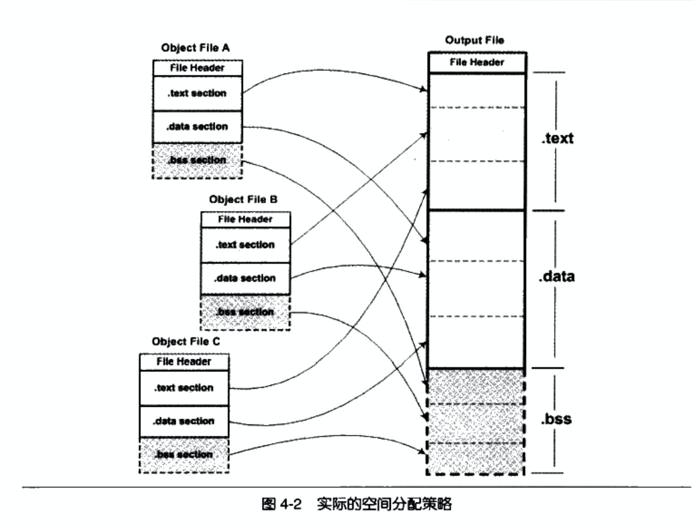
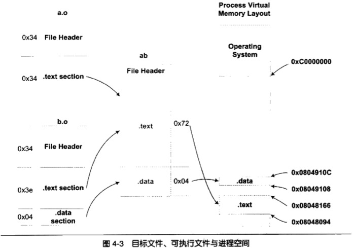

# 静态链接
静态链接是链接的核心类容


## 空间与地址分配

可执行文件中的代码段和数据段都是由输入的目标文件中合并而来的. 但是对于多个输入目标文件, 链接器如何将它们的各个段合并到输出文件?

### 按序叠加
将输入的目标文件按照次序叠加起来, 就是直接将各个目标文件依次合并. 在有很多输入文件的情况下, 这样做会使得输出文件中有很多零散的段, 非常浪费空间(每个段都需要一定的地址和空间对齐要求). 对于x86的硬件来说, 段的装载地址和空间对齐单位是页(4096字节), 如果一个段的长度只有1字节, 它也要在内存中占用4096字节. 这样会造成内存空间大量的内部碎片.

### 相似段合并

将相同性质的段合并到一起, 比如将所有输入文件`.text`合并到输出文件的`.text`段. 



`.bss`段在目标文件和可执行文件中并不占用文件的空间, 但是它在装载时占用地址空间, 所以链接器在合并各个段的同时, 也将`.bss`段合并, 并且分配虚拟空间.

`链接器为目标文件分配地址和空间`这句话中的`地址和空间`有2个含义:
1. 在输出的可执行文件中的空间.
2. 在装载后的虚拟地址中的虚拟地址空间.

对于有实际数据的段(`.text, .data`)来说, 它们在文件中和虚拟地址中都要分配空间, 因为它们在两者中都存在. 对于`.bss`段来说, 分配空间的意义只局限于虚拟地址空间, 因为它在文件中并没有内容.

本节谈到的空间分配只关注于虚拟地址空间分配, 因为这个关系到链接器后面关于地址计算的步骤, 而可执行文件本身的空间分配与链接过程关系不大.

### 两步链接 `Two-pass Linking`
现在的链接器空间分配的策略基本都采用`相似段合并`, 整个链接过程分为2步骤

1. 空间地址分配
    - 扫描所有的输入目标文件, 获得它们的各个段的长度, 属性和位置.
    - 将输入目标文件中的符号表中所有的符号定义和符号引用收集起来, 统一放到一个全局符号表.
    - 链接器将能够获得所有输入目标文件的段长度, 并且将他们合并, 计算出输出文件中各个段合并后的长度与位置, 并建立映射关系.

2. 符号解析与重定位
    - 使用第一步中收集到的所有信息, 读取输入文件中段的数据, 重定位信息, 并且进行符号解析与重定位, 调整代码中的地址等.
    - 第二步是链接过程的核心, 特别是重定位过程.


```sh
gcc -c -fno-stack-protector a.c b.c # gcc提供了栈保护机制stack-protector. 为了保证ld能顺利执行, 需要显示禁止stack-protector

ld a.o b.o -e main -o ab # -e main表示将main函数作为程序的入口, ld链接器默认的入口是_start. -o ab 表示链接输出文件, 默认是a.out

```


- VMA(Virtual Memory Address)即虚拟地址. 链接前后的程序中使用的地址已经是程序在进程中的虚拟地址.
- LMA(Load Memory Address)即加载地址.

在链接之前, 目标文件中所有段的VMA都是0, 因为虚拟空间还没有被分配(默认都为0). 链接之后, 各个段都被分配到了相应的虚拟地址. 


### 符号地址的确定

因为各个符号在段内的相对位置是固定的, 链接器需要给每个符号加上一个偏移量, 使他们能够调整到正确的虚拟地址.

## 符号解析与重定位

### 重定位

编译器在将`a.c`编译成指令时, 如何访问`shared`变量, 如何调用`swap`函数.
当源代码`a.c`在被编译成目标文件时, 编译器并不知道`shared`和`swap`的地址(因为他们定义在其他目标文件中),所以编译器暂时把地址0看作是`shared`的地址.
真正地址计算的工作留给了链接器.

### 重定位表
在elf文件中. 重定位表(Relocation Table)的结构专门用来保存这些与重定位相关的信息. 它在elf文件中往往是一个或多个段.

对于每个需要被重定位的ELF段都有一个对应的重定位表,而一个重定位表往往是ELF文件中的一个段.
- 如代码段`.text`如有要被重定位的地方, 就会有相应的`.rel.text`的段保存了代码的重定位表
- 代码段`.data`有要被重定位的地方,就会有相应的`.rel.data`的段保存了数据段的重定位表

可以使用`objdump -r a.o`来查看目标文件的重定位表.

对于32位x86系列处理器来讲, 重定位表的结构如下(它是一个Elf32_Rel结构的数组, 每个元素对应一个重定位入口)
```cpp
typedef struct {
    Elf32_Addr r_offset;
    Elf32_Word r_info;
} Elf32_Rel;
```
| 字段 | 描述 |
| ---- | ---- |
| r_offset | 重定位入口的偏移. 对于可重定位文件来说, 这个值是该重定位入口所要修正的位置的第一个字节相对于段起始的偏移. 对于可执行文件或共享文件来说, 这个值是该重定位入口所要修正的文职的第一个字节的虚拟地址|
| r_info | 重定位入口的类型和符号. 这个成员的低8位表示重定位入口的类型, 高24位表示重定位入口的符号在符号表的下标 |

### 符号解析

重定位过程也伴随着符号解析的过程. 每个目标文件都可能定义一些符号, 也可能引用到定义在其他目标文件的符号. 重定位的过程中, 每个重定位的入口都是对一个符号的引用, 当链接器需要对某个符号的引用进行重定位时, 它就要确定这个符号的目标地址. 此时链接器就会去查找全局符号表, 找到相应的符号后进行重定位.


`GLOBAL`类型的符号, 除了`main`函数式定义在代码段之外, 其他两个`shared, swap`都是`UND`即`undefined`未定义类型, 这种未定义的符号都是因为该目标文件中有关它们的重定位项.所以在链接器扫描完所有的输入目标文件之后, 所有未定义的符号都应该能够在全局符号表中找到, 否则链接器就报符号未定义错误.

### 指令修改方式
x86系列CPU的指令寻址方式有如下几方面的区别:
1. 近址寻址或远址寻址
2. 绝对寻址或相对寻址
3. 寻址长度为8位, 16位, 32位或64位
对于32位x86平台下的ELF文件的重定位入口所修正的指令寻址方式只有两种:
1. 绝对近址32位寻址
2. 相对近址32位寻址
这两种重定位方式指令修正方式`每个被修正的位置的长度都为32位, 即4字节`.而且都是近址寻址, 不用考虑intel段间远址寻址. 唯一的区别就是绝对寻址和相对寻址.

重定位入口的r_info成员的低8位表示重定位入口类型:


绝对寻址修正和相对寻址修正的区别就是绝对寻址修正后的地址为该符号的实际地址. 相对寻址修正后的地址为符号距离被修正位置的`地址差`.

## COMMON块
编译器将未初始化的全局变量定义作为弱符号处理. 比如符号`global_uninit_var`(使用`readelf -s` 查看)

可以看到它是一个全局对象, 类型为`SHN_COMMON`类型, 是一个典型的弱符号. 如果在另外一个文件中也定义了`global_uninit_var`变量, 且未初始化, 它的类型为double, 占8个字节. 按照`COMMON`类型的链接规则, 原则上讲最终输出文件中`global_uninit_var`的大小以输入文件中最大的那个为准(即连接后输出文件中`global_uninit_var`所占的空间为8个字节). 

当编译器将一个编译单元编译成目标文件的时候, 如果该编译单元包含了弱符号(未初始化的全局变量就是典型的弱符号), 那么该弱符号最终所占空间的大小在此时是未知的, 因为有可能其他编译单元中该符号所占的空间比本编译单元的要大.所以编译器此时无法为该弱符号在BSS段分配空间(所需要的空间大小未知).

但是链接器在链接过程中可以确定弱符号大小, 因为当链接器读取所有输入目标文件以后, 任何一个弱符号的最终大小都可以确定了, 所有它可以在最终输出文件的BSS段为其分配空间.总体来看, 未初始化的全局变量最终还是被放在BSS段的.


GCC中`-fno-common`允许把所有未出世话的全局变量不以`COMMON`块的形式处理, 或者使用`__attribute__`扩展:`int global __attribute__((nocommon));`.一个未初始化的全局变量不是以`COMMON`块的形式存在, 那么它就相当于一个强符号, 如果其他目标文件还有同一个变量的符号定义, 连接是就会发生符号重复定义的错误.

## C++相关问题
C++的一些语言特性必须由编译器和链接器共同支持才能完成工作.(如C++的重复代码消除, 全局构造与析构). C++语言的各种特性(虚拟函数, 函数重载, 继承, 异常)等, 这些数据结构非常复杂, 在不同的编译器和链接器之间不能通用, 导致C++程序的二进制兼容性不好.

### 重复代码消除
C++编译器在很多时候会产生重复代码, 如模板(`Templates`),外部内联函数(`Extern Inline Function`)和虚拟函数(`Virtual Function Table`)都可能在不同的编译单元生成相同的代码.
重复代码造成的问题:
- 空间浪费.
- 地址交易出错. 有可能两个指向同一个函数的指针会不相等
- 指令运行效率较低. cpu会对指令和数据进行缓存, 如果同一份指令有多个副本, 导致指令Cache的命中率降低

解决方法:
将每个模板的实例代码都单独放在一个段里, 每个段只包含一个模板实例.如模板函数`add<T>()`,某个编译单元以int和float类型实例化了该模板函数, 那么该编译单元的目标文件中就包含了两个该模板实例的段(假设段名字分别叫做`.temp.add<int>和.temp.add<float>`), 当别的编译单元也以int或float类型实例化该模板函数后, 也会生成同样的名字. 这样链接器在最终链接的时候可以区分这些相同的模板实例, 然后将他们合并到最终的代码段.

CNU GCC编译器和VISUAL C++编译器都采用了类似的方法.

- GCC: 把这种类似的须要在最终连接时合并的段叫`Link Onec`(具体命名是`.gnu.linkonece.name`)
- VASUAL C++: 把这种类型的段叫做`COMDAT`.链接器识别到`COMDAT`类型的段后, 会将重复的段丢弃.

### 全局构造与析构
C++的全局对象的构造函数在main之前被执行, C++全局对象的析构函数在main之后被执行.Linux系统下一般程序的入口是`_start`(这个函数是Glibc)的一部分.当我们的程序与Glibc库链接在一起形成最终可执行文件以后, 这个函数就是程序的初始化部分的入口.

ELF文件定义了两种特殊的段:

- `.init` 该段里面保存的是可执行指令, 它构成了进程的初始化代码. 当一个程序开始运行时, 在main函数被调用之前, Glibc的初始化部分安排执行这个段的中间代码.
- `.fini` 该段保存着进程终止代码指令. 当一个程序的main函数正常退出时, Glibc会安排执行这个段中的代码.

### C++与ABI

我们把符号修饰标准, 变量内存布局, 函数调用方式等这些与可执行代码二进制兼容性相关的内容称为ABI(`Application Binary Interface`)

- API: 指源代码街边的接口
- ABI: 指二进制层面的接口

## 静态库链接
一种语言的开发环境往往会附带语言库(Language Library), 这些库就是对操作系统的API的包装.

## 链接过程控制
大部分情况下, 我们使用链接器提供的默认链接规则对目标文件进行链接. 对于一些特殊要求的程序(如操作系统内核, BIOS等), 他们往往受限于一些特殊的条件, 所以会对程序的各个段的地址有着特殊的要求(使用那些目标文件? 使用哪些库文件? 是否在最终可执行文件中保留调试信息?输出文件格式?).

### 链接控制脚本
链接器一般提供多种控制整个链接过程的方法, 以用来产生用户所需要的文件.
1. 使用命令行来给链接器指定参数. 如 ld的-o,-e参数
2. 将链接指令存放在目标文件里面, 编译器经常会通过这种方法向链接器传递指令.
3. 使用链接控制脚本.

由于各个链接器平台的链接控制过程各不相同, 只能侧重一个平台来介绍(本书以ld作为主要介绍对象). `VISUAL C++`也允许使用脚本来控制整个链接过程(叫做模块定义文件Module-Definition File`.def`). 

ld在用户没有指定链接脚本的时候会使用默认链接脚本

```sh
ld -verbose
```
默认的ld链接脚本存放在`/usr/lib/scripts`下, 不同的机器平台, 输出文件格式都有相应的链接脚本. ld会根据命令行要求使用相应的链接脚本来控制链接过程.用ld链接生产可执行文件是使用`elf_i386.x`,当ld生成一个共享目标文件时会使用`elf_i386.xs`.
为了更加精确的控制链接过程,也可以自己写脚本`ld -T link.script`

### 最"小"的程序
为了演示链接的控制过程, 需要做一个最小的程序: 功能是在终端上显示`hello world`

- 希望"小程序"能够脱离c语言运行库, 使得它成为一个独立于任何库的纯正的"程序"
- 经典的helloworld由于使用了库, 所以必须要有main函数(一般程序的入口在库的_start, 由库负责初始化后调用main函数来执行程序主体部分). 为了不使用main函数, "小程序"使用nomain作为程序入口
- 经典的helloworld会产生多个段(main程序的指令部分会产生.text段, 字符串常量"hellow world!"会被放在数据段或只读数据段, 还有c库所包含的各种段). 为了演示ld链接脚本的控制过程, 将"小程序"的所有段都合并到一个叫"tinytext"的段(任意命名的, 是有链接脚本控制链接过程生成的)

`TinyHelloWorld.c`源代码如下;
```c
char* str = "Hello world!\n";

void print()
{
    asm volatile(
        "movl $13, %%edx    \n\t"
        "movl %0, %%ecx     \n\t"
        "movl $0, %%ebx     \n\t"
        "movl $4, %%eax     \n\t"
        "int $0x80          \n\t"
        ::"r"(str):"edx","ecx","ebx"
    );
}

void exit()
{
    asm volatile(
        "movl $42, %ebx    \n\t" 
        "movl $1, %eax     \n\t"
        "int $0x80         \n\t"
     );
}

void nomain()
{
    print();
    exit();
}
```

程序入口为nomain函数, 然后调用print()函数, 打印`hello world`, 再调用`exit()`函数, 结束进程.

GCC内嵌汇编: 其中print函数使用了Linux的`WRITE系统调用`, exit函数使用了`EXIT系统调用`. 

编译&链接:
```sh
gcc -c -fno-builtin -m32 TinyHelloWorld.c

ld -m elf_i386 -static -e nomain -o TinyHelloWorld TinyHelloWorld.o
```
参数:
- `-m32` 在64位cpu上使用, 表示显式使用32位来进行编译(因为程序中使用到了32位寄存器). [参考](https://stackoverflow.com/questions/11372024)
- `-fno-builtin` GCC编译器提供了很多内置函数(Built-in Function). 它会把一些常用的C库函数替换成编译器的内置函数, 以达到优化功能(比如GCC会将只有字符串参数的printf函数替换成puts, 以节省格式解析时间. exit()函数也是GCC内置参数之一). 所以使用`-fno-builtin`来关闭GCC内置函数功能.
- `-m elf_i386` ld在64位cpu上默认以64位的方式链接, 使用后以32位的方式链接. [参考](https://www.cnblogs.com/liubiyonge/p/9405623.html)
- `-static` 表示ld将使用静态链接的方式来链接程序, 而不是使用默认的动态链接的方式.

- `-e nomain`表示该程序的入口函数为`nomain`. 此参数将ELF文件头的`e_entry`成员赋值成`nomain`函数的地址.

- `-o TinyHelloWorld` 表示输出可执行文件名

运行完成之后得到ELF可执行文件, 运行它以后能够正确打印`HelloWorld!`并且能正常退出.使用objdump查看时主要有4个段:`.text, .rodata, .data, .comment`

- `.text`保存的是程序指令, 是只读的
- `.rodata`保存的是字符串`Hello World!\n`, 是只读的
- `.data`保存的是str全局变量, 看上去是可读写的. 单并没有在程序中改写该变量, 所以实际上也是只读的
- `.comment`保存的是编译器和系统版本信息, 是只读的. 由于`.comment`里面保存的数据对程序运行没有作用, 所以可以将其丢弃

上述这些段的属性十分相似, 原则上讲, 我们可以将其合并到一个段里面, 该段的属性是可执行,可读的, 包含程序的数据和指令. 为了达到这个目的, 必须使用ld链接脚本来控制链接过程

### 使用ld链接脚本

ld链接器以所有的目标文件,库文件作为输入, 输出的是可执行文件. 链接控制脚本使用一种特殊的语言写成(ld的链接脚本语言).

无论是输出文件还是输入文件, 他们的主要的数据就是文件中的各个段. 把输入文件中的段称为输入段(Input Sections), 输出文件中的段称为输出段(Output Sections).控制链接过程就是控制输入段如何变成输出段.

链接脚本`TinyHelloWorld.lds`(一般链接脚本都以lds作为扩展名, ld script)

```lds
ENTRY(nomain)

SECTIONS
{
    . = 0x08048000 + SIZEOF_HEADERS;
    tinytext  : {    *(.text) *(.data) *(.rodata)    }
    /DISCARD/ : {    *(.comment) }
}
```
解释: 
- `ENTRY(nomain)`指定了程序入口为`nomain()`函数. 
- `SECTIONS`命令一般是链接脚本的主体. 指定了各个输入段到输出段的变换.其中有三条语句, 第一条是赋值语句, 后面两条是段转换规则
- `.= 0x08048000 + SIZEOF_HEADERS`: 将当前虚拟地址设置成`0x08048000 + SIZEOF_HEADERS`.`SIZEOF_HEADERS`为输出文件的文件头大小. `.`表示当前虚拟地址, 因为这条语句后面紧跟着输出段`tinytext`, 所以`tinytext`段的起始虚拟地址为`0x08048000 + SIZEOF_HEADERS`
- `tinytext  : {    *(.text) *(.data) *(.rodata)    }`: 表示段转换规则. 所有输入文件中的名字为`.text,.data,.rodata`的段依次合并到输出文件的`tinytext`
- `/DISCARD/ : {    *(.comment) }`: 将所有输入文件中的名字为`.comment`的段丢弃, 不保留到输出文件中.

编译&链接:
```sh
gcc -c -fno-builtin -m32 TinyHelloWorld.c

ld -m elf_i386 -static -T TinyHelloWorld.lds -o TinyHelloWorld TinyHelloWorld.o
```

### ld链接脚本语法简介

ld链接器的链接脚本语法继承与AT&T链接器命令语言的语法(风格有点像C语言).链接脚本由一系列语句组成, 语句分两种, 一种是`命令语句`(如: ENTRY(nomain)), 另一种是`赋值语句`(如 . = 0x08480000 + SIZEOF_HEADERS).

- `语句之间使用分号";"作为分隔符`: 原则上讲语句之间都要以`;`作为分隔符, 但是对于命令语句来说也是可以使用换行来结束该语句, 对于赋值语句来说
- `表达式与运算符`: 脚本语言的语句中可以使用C语言类似的表达式和运算操作符, 如`+,-,*,/,+=,-=,*=`等, 也包括`&,|,>>,<<`等位操作符
- `注释和字符引用`: 使用`/**/`作为注释. 脚本文件中使用到的文件名,格式名或段名等凡是包含`;`或其他分隔符的, 都要使用双引号将名字全称引用起来. 如果名字中也包含引号, 则无法处理.

`SECTIONS`命令语句负责指定链接过程的段转换过程, 这也算链接的最核心的部分. 除了`SECTIONS`语句之外, 其他命令语句都比较简单:


| 命令语句 | 说明 |
| ---- | ---- |
| ENTRY(symbol) | 指定符号symbol的值为入口地址(Entry Point). 入口地址即进程执行的第一条用户空间的指令在进程地址空间的地址. 它被指定在ELF文件头Elf32_Ehdr的e_entry成员中.ld有多种方法可以设置进程入口地址, 它们之间的优先级如下:<br/>1. ld命令行的-e选项<br/>2. 链接脚本的ENTRY(symbol)命令<br/>3. 如果定义了_start符号, 使用_start符号值<br/>4. 如果存在.text段, 使用.text段的第一字节的地址<br/>5. 使用值0 |
| STARTUP(filename) | **将文件filename作为链接过程中的第一个输入文件** |
| SEARCH_DIR(path) | **将路径path加入到ld链接器的库查找目录**. ld会根据指定的目录去查找相应的库. 和`-Lpath`命令作用相同 |
| INPUT(file, file, ...)<br/> INPUT(file, file, ...)| 将指定文件作为链接过程中的输入文件 |
| INCLUDE filename | **将指定文件包含进本链接脚本**.类似于c语言中的#include预处理 |
| PROVIDE(symbol) | **在链接脚本中定义某个符号**. 该符号可以在程序中被引用. 其实前文提到的特殊符号都是由系统默认的链接脚本通过PROVDE命令定义在脚本中的 |

SECTIONS命令语句最基本格式为:
```
SECTIONS
{
    ...
    secname : {contents}
    ...
}
```
`secname`表示输出段的段名, secname后面必须有一个空格符,这样使得输出段名不会有歧义. 后面紧跟着冒号和一对大括号. 大括号里面的contents描述了一套规则和条件, 它表示符合这种条件的输入段将会被合并到这个输出段中.输出段的命名方法必须符合输出文件格式的要求.

如果使用ld生产一个a.out格式的文件, 那么输出段名就不可以使用除了`.text, .data, .bss`之外的任何名字, 因为`a.out`格式规定段名只允许这三个名字.

`/DISCARD/`: 特殊的段名, 所有符合contents所规定的添加的段都将被丢弃, 不输出到输出文件中.

`contents`规则: contents中可以包含若干个条件, 每个条件之间以空格隔开, 如果输入段符合这些条件中的任一一个, 即表示这个输入段符合contents规则.

语法: `filename(sections)` filename表示输入文件名, sections表示输出段名.

- `file1.o(.data)`表示输入文件中名为file1.o的文件中名叫`.data`的段符合条件.
- `file1.o(.data .rodata)`或`file1.o(.data, .rodata)`表示输入文件中名为`file1.o`的文件中的名叫`.data`或`.rodata`的段符合条件.
- `file1.o` 如果直接指定文件名而省略后面的小括号和段名, 则表示file1.o的所有段都符合条件.
- `*(.data)` 所有输入文件中的名字为`.data`的文件符合条件.`*`是通配符, 类似于正则表达式中的`*`, 还可以使用正则表达式中的`?`,`[]`等规则.
- `[a-z]*(.text*[A-Z])` 表示所有输入文件中以小写字母a到z开头的文件中所有段名以`.text`开头, 并且以大写字母A到Z结尾的段.

## BFD库

由于现代的硬件和软件平台种类非常繁多,导致了每个平台都有独特的目标文件格式, 即使同一个格式(如`ELF`)在不同的软硬件平台都有着不同的变种. 这些差异导致编译器和链接器很难处理不同平台之间的目标文件, 对于像`GCC`和`binutils`这种跨平台的工具来说, 最好有一种统一的接口来处理这些不同格式之间的差异.

BFD库(Binary File Descriptor library)就是这样的一个GNU项目, 它的目标就是希望通过一种统一的接口来处理不同的目标文件格式. BFD把目标文件抽象成一个统一的模型, 在这个抽象的目标文件模型中, 最开始有一个描述整个目标文件总体信息的"文件头",就跟实际的ELF文件一样, 文件头后面是一系列的段, 每个段都有名字,属性和段的内容, 同时还抽象了符号表, 重定位表, 字符串表等类似的概念.使得BFD库的程序只要通过操作这个抽象的目标文件模型就可以实现操作所有BFD支持的目标文件格式.

现在GCC(GNU汇编器GAS, GNU Assembler),链接器ld, 调试器GDB及binutils的其他工具都通过BFD库来处理目标文件, 而不是直接操作目标文件. 这样做的好处是将编译器和链接器本身同具体的目标文件格式隔离开来, 一旦需要支持一种新的目标文件格式, 只需要在BFD库里面添加一种格式就可以了, 无需修改编译器和链接器.