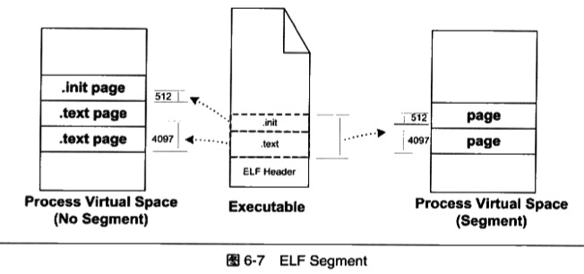

# 可执行文件的装载与进程
可执行文件只有装载到内存以后才能被CPU执行.

## 进程的虚拟地址空间
每个程序运行起来以后, 它将拥有自己独立的**虚拟地址空间(Virtual Address Space)**, 这个虚拟地址空间的大小由计算机的硬件平台决定(是由CPU的位数决定).硬件决定了地址空间的最大理论上限(即硬件的寻址空间大小), 如32位的硬件平台决定了虚拟地址空间的地址为`0~2^32-1`(即0x00000000~0xffffffff, 共4GB虚拟空间大小),而64位的硬件平台具有64位寻址能力,它的虚拟地址空间达到了2^64字节(即0x0000000000000000~0xffffffffffffffff, 共17179869184GB).

可以通过判断c语言中的指针所占空间来计算虚拟地址空间大小. 一般来说c语言指针大小的位数与虚拟空间的位数相同, 如32位平台下的指针为32位(4字节), 64位平台下的指针为64位(8字节)

### 可以使用的空间
对于32位平台下的4GB虚拟空间, 我们的程序并不能任意使用. 因为程序在运行的时候处于操作系统的监管之下, 进程只能使用那些操作系统分配给进程的地址, 如果访问未经允许的空间, 会当做非法操作, 强制结束进程.

在linux操作系统下, 4GB的进程虚拟地址空间被划分为2部分. 从`0xC0000000~0xFFFFFFFF`共1GB供操作系统本身使用, 剩下的从`0x00000000~0xBFFFFFFF`共3GB是留给进程使用的. 所以整个进程在执行的时候, 所有的代码,数据,通过c语言malloc()等方法申请的虚拟空间之和不能超过3GB.

### PAE(Physical Address Extension)

从硬件层面上讲, 32位地址线只能访问最多4GB的物理内存, 扩展到36位地址线后, Intel修改了页映射的方式, 使得新的映射方式可以访问到更多的物理内存. Intel把这种扩展方式叫做PAE

- 虚拟地址空间: 32位CPU只能使用32位指针, 最大寻址返回是0~4GB, 所以只能使用不超过4GB的虚拟地址空间.
- 内存空间: 内存空间由寻址能力决定(地址总线的宽度), 32位CPU可以扩展到36位地址线, 可以访问2^36=64GB物理内存.

## 装载的方式

程序执行时所需要的指令和数据必须在内存中才能正常运行

- 静态装入: 最简单的办法就是将程序运行所需要的指令和数据全都装入内存中.

- 动态装载: 程序用到哪个模块, 就将哪个模块装入到内存, 如果不用就暂时不装入, 存放在磁盘中.

覆盖装入(`Overlay`)和页映射(`Paging`)是两种很典型的动态装载方法.

### 覆盖装入
覆盖装入在没有发明虚拟存储之前使用比较广泛, 现在几乎都使用页映射. 覆盖装入依赖于程序员, 在编程时需要手工将程序分为若干块, 然后编写辅助代码(覆盖管理器 `Overlay Manager`)来管理这些模块何时应该驻留内存何时应该被替换掉.

最简单的情况, 一个程序有主模块`main`, `main`分别会调用到模块A和模块B, A和B之间不会相互调用. 这三个模块的大小分别是1024b,512b和256b. 假设不考虑内存对齐, 装载地址限制的情况, 理论上运行这个程序需要有1792个字节内存.如果采用覆盖装入的办法, 在内存中可以这样安排.


由于A和B之间没有相互调用依赖关系, 我们可以把模块A和B在内存中`相互覆盖`, 即两个模块共享内存区域. 当main调用模块A时, 覆盖管理器保证将模块A从文件读入到内存. 当main调用模块B时, 覆盖管理器将B从文件读入内存, 且模块B可以装入到原来模块A所占用的内存空间. 所以, 处理覆盖管理器, 整个程序运行只需要1536个字节, 比原来的方案省了256字节的空间.

在多个模块的情况下, 程序员需要手工将模块按照它们之间的调用依赖关系组织成树状结构.


这个树状结构中从任何一个模块到树的根(也就是main)模块都叫`调用路径`. 当该模块被调用时, 整个调用路径上的模块必须都在内存中. 比如程序在模块E中执行代码, 那么模块B和模块main必须都在内存中, 以确保模块E执行完毕以后能够正确返回至模块B和模块main.

禁止跨树间调用. 任意一个模块不允许跨过树状结构进行调用.如上面的例子, 模块A不可以调用模块BEF.因为覆盖管理器不能够保证跨树间的模块能够存在于内存中.很多时候两个子模块都需要依赖于某个模块, 比如E和C都需要另外一个G, 那么最方便的做法就是将G并入到main中, 这样G就在E和C的调用路径上了.

由于跨模块间的调用都需要经过覆盖管理器, 以确保所有被调用到的模块都能够正确地驻留内存, 而且一旦模块没有在内存中,就需要从磁盘或其他存储器读取相应的模块, 所以覆盖装入的速度是比较慢, 这是一种折中方案, 是典型的利用时间换取空间的方法.


### 页映射

页映射是虚拟存储机制的一部分, 将内存和所有磁盘中的数据和质量按照`页(Page)`为单位划分成若干个页, 以后所有的装载和操作的单位就是页. 以目前的情况, 硬件规定的页大小有4096b,8192b,2mb,4mb等.常见的Intel IA32处理器一般都使用4096字节的页, 那么512mb的物理内存就拥有`512*1024*1024/4096=131072`个页.

为了演示页映射的基本机制, 假设我们的32位机器有16kb内存,每个页的大小为4096b,则共有4个页:

| 页编号 | 地址 |
| ---- | ---- |
| F0 | 0x00000000 - 0x00000FFF |
| F1 | 0x00001000 - 0x00000FFF |
| F2 | 0x00000000 - 0x00000FFF |
| F3 | 0x00000000 - 0x00000FFF |

假设程序所有的指令和数据总和为32kb, 那么程序总共被分为8个页, 编号为`p0-p7`. 由于16kb的内存无法同时将32kb的程序装入, 所以将按照动态装入的原理来进行整个装入过程. 如果程序刚开始执行时的入口地址在p0, 这时装载管理器(装载的过程由装载管理器控制)发现程序的p0不在内存中, 于是将F0分配给P0, 并将p0的内容装入F0; 运行一段时间后程序要用到p5, 于是装载管理器将p5装入f1;随后当程序用到p3和p6时,分别被装入到F2和F3. 映射关系如下:


此时内存已经装满, 如果程序需要访问p4, 那么装载管理器必须做出选择, 必须放弃目前正在使用的4个内存页其中的一个来装载p4(如何选择? 装载管理器有特定的算法, 如: 先进先出算法FIFO, 最少使用算法LUR).

目前主流的操作系统都是按照这种方式装载可执行文件的,如windows对PE文件的装载以及Linux对ELF文件的装载


## 从操作系统角度看可执行文件的装载

通过页映射的动态装入的方式可以看到, 可执行文件中的页可能被装入内存中的任意页.比如程序需要P4的时候,它可能被装入F0-F3这4个页中的任意一个. 如果程序使用物理地址直接进行操作, 那么每次页被装入时都需要进行重定位. 在虚拟存储中, 现代的硬件MMU(内存管理单元)都提供地址转换功能. 硬件的地址转换和页映射机制, 保证了操作系统能动态加载可执行文件.

### 进程的建立

从操作系统来看, 一个进程最关键的特征是拥有独立的虚拟进程空间, 使得它有别于其他进程.

场景: 创建一个进程, 然后装载相应的可执行文件并且执行. 在有虚拟存储的情况下, 上述过程最开始只需要做三件事情

1. 创建一个独立的虚拟地址空间. 解决虚拟空间到物理内存的映射关系
    - 虚拟空间由一组页映射函数将虚拟空间的各个页映射到相应的物理空间.创建一个虚拟空间实际上并不是创建空间而是创建映射函数所需要的相应的数据结构. 在i386的Linux下, 创建虚拟地址空间实际上只分配一个页目录(`Page Directory`)就可以了, 甚至不设置页映射关系, 这些映射关系等到后面程序发生错误的时候再进行设置.

2. 读取可执行文件头, 并且建立虚拟空间与可执行文件的映射关系.解决虚拟空间与可执行文件的映射关系

    - 当程序发生页错误时, 操作系统将从物理内存中分配一个物理页, 然后将该`缺页`从磁盘中读取到内存中,在设置缺页的虚拟页和物理页的映射关系. 其中, 当操作系统捕获到缺页错误时, 它应当知道程序当前所需要的页在可执行文件中的哪一个位置. 这既是虚拟空间与可执行文件之间的映射关系. 这一步是整个装载过程中最重要的一步, 也是传统意义上`装载`的过程.

    > 由于可执行文件在装载时实际上是被映射的虚拟空间, 所以可执行文件很多时候又被叫做**镜像文件**(Image)

    假设一个ELF可执行文件只有一个代码段`.text`,它的虚拟地址为`0x08048000`,它在文件中的大小为`0x000e1`, 对齐为`0x1000`. 由于虚拟存储的页映射都是以页为单位的, 在32位的Intel IA32下一般为4096字节, 所以32位ELF的对齐粒度为`0x1000`. 由于该.text段大小不到一个页, 考虑到对齐该段占用一个段. 所以一旦该可执行文件被装载, 可执行文件与执行该可执行文件进程的虚拟空间的映射关系如下:

    


    这种映射关系只是保存在操作系统内部的一个数据结构,Linux中将进程虚拟空间中的一个段叫做虚拟内存区域(VMA, Virtual Memory Area), 在Windows中将这个叫做虚拟段(Virtual Section). 如上列中, 操作系统创建进程后, 会在进程相应的数据结构中设置一个.text段的VMA: 它在虚拟空间中的地址为0x08048000-0x08048000, 它对应ELF文件中偏移为0的.text, 它的属性为只读, 还有一些其他的属性.

3. 将CPU的指令寄存器设置成可执行文件的入口地址, 启动运行.
    - 操作系统通过设置CPU的指令寄存器将控制权交给进程, 由此进程开始执行. 在操作系统层面上比较复杂, 涉及内核堆栈和用户堆栈的切花你,CPU运行权限的切换. 从进程角度来看这一步可以简单任务操作系统执行了一条跳转指令, 直接跳转到可执行文件的入口地址(ELF文件头中保留有入口地址)

### 页错误

进程创建完成之后, 其实可执行文件的真正指令和数据都没有被装入到内存中. 操作系统只是通过可执行文件头部的信息建立起可执行文件和进程虚存之间的映射关系.

上面的例子中, 假设程序的入口地址是`0x08048000`,即刚好是.text段的起始地址. 当CPU开始打算执行这个地址的指令时, 发现页面`0x08048000-0x08049000`是个空页面, 于是它认为这是一个页错误(Page Fault).CPU将控制权交给操作系统, 操作系统有专门的页错误处理例程来处理这种情况. 此时,在装载过程的第二步建立的数据结构起到了关键作用, 操作系统根据这个数据结构, 找到空页面所在的VMA,计算相应的页面在可执行文件中的偏移, 然后在物理内存中分配一个物理页面, 将进程中该虚拟页与分配的物理页之间建立映射关系, 然后把控制权再还给进程, 进程从刚才错误的位置重新开始执行.

随着进程的执行, 页错误也不断产生, 操作系统也会为进程分配相应的物理页面来满足进程执行的需求.当进程所需要的内存超过可用的内存数量时, 操作系统就需要精心组织和分配物理内存(涉及虚拟存储管理).


## 进程虚存空间分布

### ELF文件链接视图和执行视图

在一个进程中, 可执行文件中包含的往往不止代码段, 还有数据段, BSS等, 所以映射到进程虚拟空间的往往不止一个段.当段的数量增多时, 就会产生空间浪费问题. 因为ELF文件被映射时, 是以系统的页长度作为单位的, 那么每个段在映射时的长度应该都是系统页长度的整数倍, 如果不是, 那多余部分也将占用一个页. 一个ELF文件中往往由十几个段, 如何减少页映射时的内存浪费?

在操作系统的角度, 装载可执行文件时, 它实际上并不关系可执行文件各个段包含的实际内容, 操作系统只关心一些跟装载相关的问题, 最主要的是段的权限(可读,可写,可执行). 

ELF文件中, 段的权限组合基本分为3种:

1. 以代码段为代表的权限为可读可执行的段
2. 以数据段和BSS段为代表的权限为可读可写段
3. 以只读数据段为代表的权限为只读的段

一个简单的方案: 对于相同权限的段, 把它们合并到一起当做一个段进行映射.

示例: 有两个段分别叫做`.text(4097b)`和`.init(512b)`, 它们包含的分别是程序的可执行代码和初始代码, 并且它们的权限相同(都是可读可执行). 如果这两个段分别映射的话要占用3个页面, 合并成一起映射的话只须占用2个页面.



ELF文件引入一个概念叫做`Segment`, 一个`Segment`包含一个或多个属性类似的`Section`. 将`.text`和`.init`段合并在一起看作是一个`Segment`,装载的时候看出一个整体一起映射, 映射以后在进程虚存空间中只有一个相对应的VMA, 这样做可以减少页面内部碎片, 节省了内存空间.

### 堆和栈
在操作系统里面, VMA除了被用来映射可执行文件中各个`Segment`以外, 操作系统还通过使用VMA来对进程的地址空间进行管理. 进程在执行的时候还需要用到栈(Stack),堆(Heap)等空间, 栈和堆在进程的虚拟空间中的表现也是以VMA形式存在的. 很多情况下, 一个进程中的栈和堆分别都有一个对应的VMA. 在Linux下, 可以通过查看`/proc`来查看进程的虚拟空间分布:


可以看到进程中有5个VMA, 只有前2个是映射到可执行文件中的两个`Segment`. 另外3个段的文件所在设备主设备号和次设备号以及文件节点号都是0, 则表明它们没有映射到文件中, 这种VMA叫做`匿名虚拟内存区域`.

另外一个特殊的VMA叫做`vdso`, 它的地址已位于内核空间范围(大于0xC0000000的地址),它是一个内核的模板.进程可以通过访问这个VMA来跟内核进行通信.

进程虚拟地址空间总结:
- 操作系统通过给进程空间划分出若干个VMA来管理进程的虚拟空间
- 基本原则: 将相同权限属性,有相同映像文件的映射成一个VMA
- 一个进程基本上可以分为如下几种VMA区域
    1. 代码VMA, 权限只读, 可执行; 有映像文件
    2. 数据VMA, 权限可读写, 可执行; 有映像文件
    3. 堆VMA, 权限可读写, 可执行; 无映像文件, 匿名, 可向上扩展
    4. 栈VMA, 权限可对象, 不可执行; 无映像文件, 匿名, 可向下扩展

一个常见进程的虚拟空间如下:


### 段地址对齐
可执行文件最终是要被操作系统装载运行的, 在装载过程中一般是通过虚拟内存的页映射机制完成的.在映射的过程中, 页是映射的最小单位. 对于intel80x86系列处理器来说, 默认的页大小为4096字节.

也就是说, 如果要映射将一段物理内存和进程虚拟地址空间之间建立映射关系,这段内存空间的长度必须是4096的整数倍,并且这段空间在物理内存和进程虚拟地址空间中的起始地址必须是4096的整数倍.

假设一个ELF可执行文件, 它有3个段(Segment)需要装载, 将其命名为`SEG0,SEG1,SEG2`,每个段的长度和在文件中的偏移如下:


每个段的长度都不是页长的整数倍, 一种最简单的映射办法就是每个段分开映射, 对于长度不足一个页面的部分则占一个页. 通常ELF可执行文件的起始虚拟地址是`0x08048000`, 如果按照这种映射方式, 该ELF文件中的各个段的虚拟地址长度如下所示:


这种对齐方式在文件段的内部会有很多内部碎片, 浪费磁盘空间. 为了解决此问题, 有些UNIX系统采用了一个很取巧的办法, 就是让那些各个段接壤的部分共享一个物理页面, 然后将该物理页面分别映射两次.比如对`SEG0和SEG1`的接壤部分的那个物理页, 系统将他们映射两份到虚拟地址空间, 一份为SEG0,另一份为SEG1, 其他的页都按照正常粒度进行映射.UNIX系统将ELF的文件头也看作是系统的一个段, 将其映射到进程的地址空间.


整个ELF文件从最开始到某个点结束, 被逻辑上分成了以4096字节为单位的若干个块, 每个块都被装载到物理内存中, 对于那些位于两个段中间的块, 会被映射2次. 在这种方法下, 上述ELF文件的映射方式如下:


在这种情况下, 内存空间得到了充分利用. 这种映射方式下, 对于一个物理页面来说, 它可能同时包含了两个段或多个段的数据, 比如文件头, 代码段, 数据段和BSS段的长度加起来都小于4096字节, 那么一个物理页面可能包含文件头, 代码段, 数据段和BSS段.


因为段地址对齐的关系, 各个段的虚拟地址往往不是系统页面长度的整数倍.

以前面`SectionMapping.elf`做例子, 计算各个段的虚拟地址:
VMA0的起始地址是`0x08048000`,长度是`0x709e5`, 所以它的结束地址是`0x080b89e5`. 而VMA1因为跟VMA0的最后一个虚拟页面共享一个物理页面, 并且映射两遍, 所以它的虚拟地址应该是`0x080b99e5`, 又因为段必须是4字节的倍数, 则向上取整至`0x080b99e8`.

### 进程栈初始化
进程启动的时候, 需要知道进程运行的环境, 最基本的是系统环境变量和进程运行的参数.操作系统在进程启动前将这些信息提前保存到进程的虚拟空间的栈中(也就是VMA中的Stack VMA).

假设系统中有2个环境变量:
```sh
HOME=/home/user
PATH=/usr/bin
```
比如我们运行该程序的命令是
```sh
prog 123
```
并且假设堆栈段底部地址为`0xBF802000`, 那么进程初始化后的堆栈如下所示:


栈顶寄存器esp指向的位置是初始化以后堆栈的顶部, 最前面的4个字节表示命令行参数的数量(此处为2, 即`prog`和`123`), 紧接的就是分布指向这两个参数字符串的指针(后面跟一个0);接着是指向环境变量字符串的指针,它们分别指向字符串`HOME=/home/user`和`PATH=/usr/bin`(后面紧跟一个0表示结束).

进程在启动后, 程序的库部分会把堆栈里的初始化信息中的参数信息传给main()函数, 也就是我们熟知的main()函数的两个argc和argv两个参数, 这两个参数分别对应这里的命令行参数数量和命令行参数字符串指针数组.

## Linux内核装载ELF过程

1. 检查ELF可执行文件格式的有效性, 比如魔术, 程序头表中断(Segment)的数量.
2. 寻址动态连接`.interp`段, 设置动态链接器路径.
3. 更加ELF可执行文件的程序头表的描述, 对ELF文件进行映射, 比如代码, 数据, 只读数据.
4. 初始化ELF进程环境, 比如进程启动时EDX寄存器的地址应该是DT_FINI的地址.
5. 将系统调用的返回地址修改成ELF可执行文件的入口点, 这个入口点取决于程序的链接方式, 对于静态链接的ELF可执行文件, 这个程序入口就是ELF文件的文件头中e_entry所指的地址; 对于动态连接的ELF可执行文件, 程序入口点是动态链接器.
